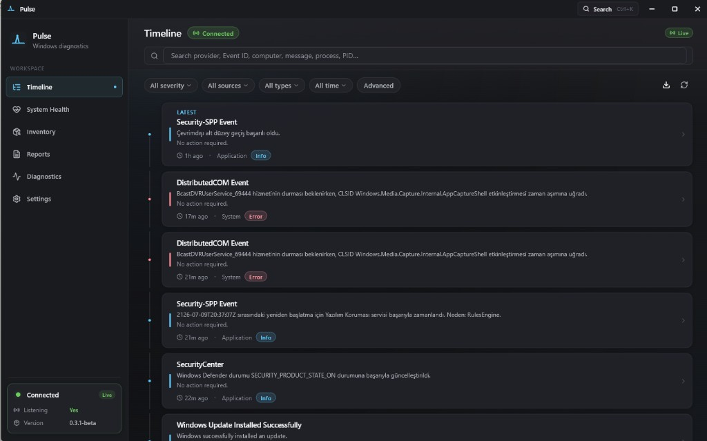
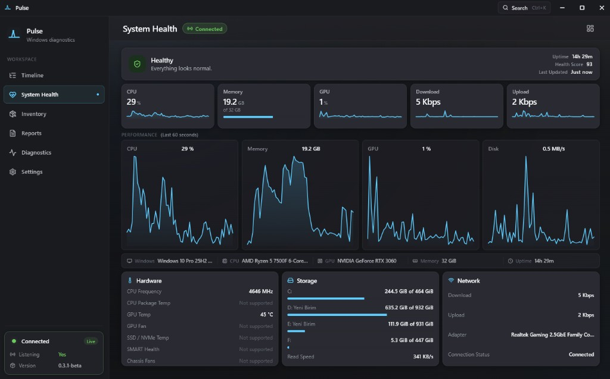
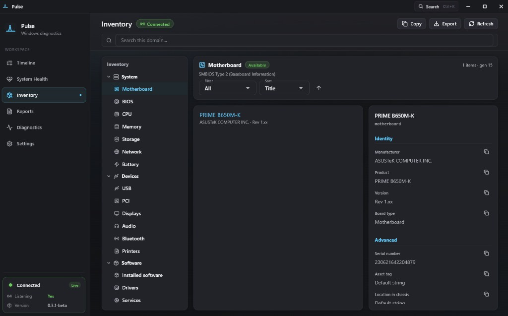
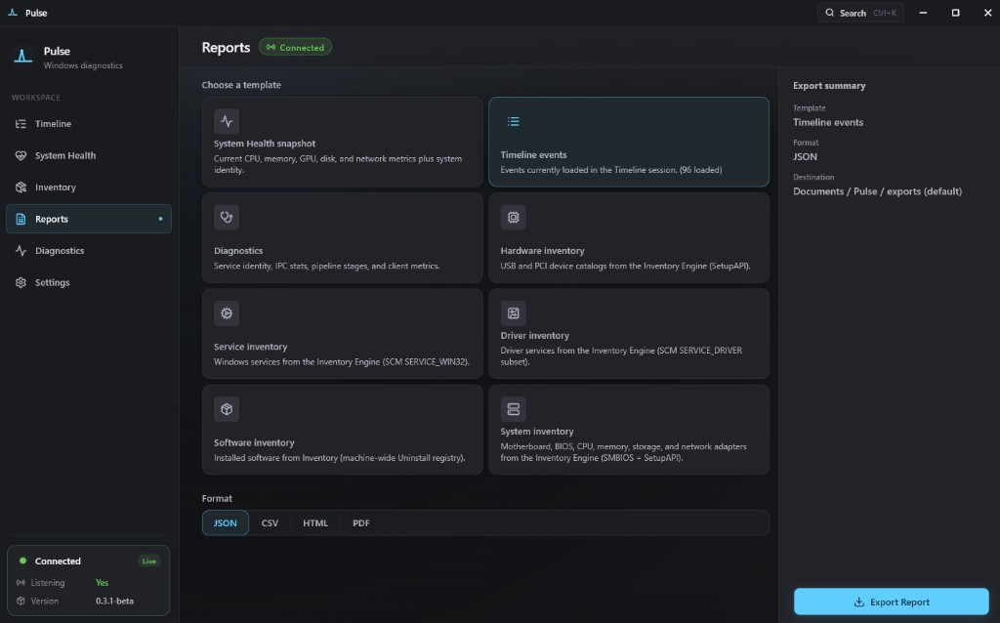
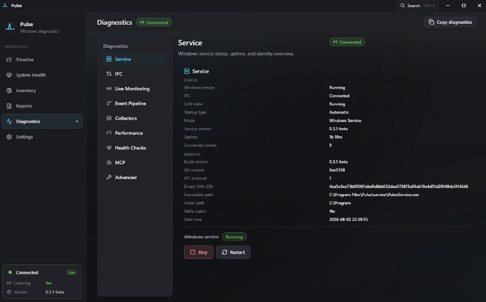
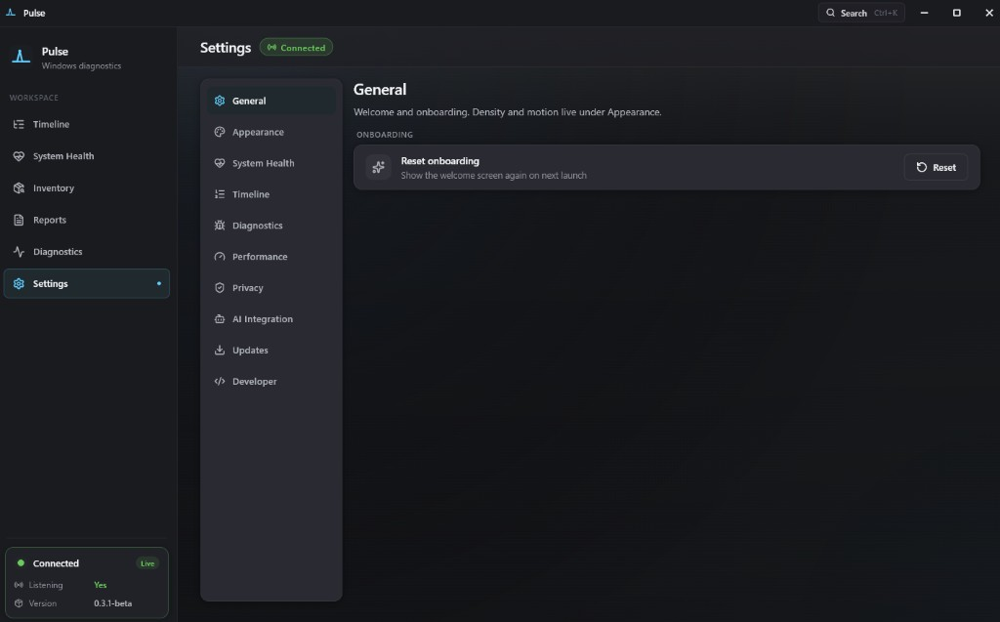

<p align="center">
  
</p>

<h1 align="center">Pulse</h1>

<p align="center">
  <strong>See what Windows is really doing.</strong><br />
  A modern, read-only diagnostics platform for Windows — events you can understand, not logs you decode.
</p>

<p align="center">
  <a href="https://github.com/Regncreative/Pulse">github.com/Regncreative/Pulse</a>
</p>

<p align="center">
  
  
  
  
  
  
  
</p>

<p align="center">
  
</p>

<p align="center"><em>Timeline — live Event Log events in plain language</em></p>

---

## What is Pulse?

Windows already knows everything about itself — crashes, service starts, explorer restarts, boot failures. The problem is how that knowledge is presented: Event Viewer IDs, opaque XML, and tools that feel like they were built for another decade.

**Pulse observes. Pulse explains. Pulse visualizes. Pulse never changes Windows.**

It turns raw system activity into a readable timeline:

| Instead of… | Pulse shows… |
|---|---|
| Application Error · Event ID 1000 | Explorer unexpectedly closed. Windows restarted Explorer. |
| Service Control Manager · 7036 | Windows Update service entered the running state. |
| Kernel-Power · 41 | The system restarted without a clean shutdown. |

Designed to feel like a built-in Windows 11 utility (Fluent Design, Mica, dark-first) — not a typical diagnostics utility.

> **Philosophy:** Observation only. No injection. No hooks. No patches. No telemetry. No cloud.

---

## Features

### Timeline
- **Human-readable events** — Level 1 plain language first; technical summary and raw XML on demand
- **Live monitoring** — Windows Event Log via `EvtSubscribe`, pushed over named-pipe IPC
- **Historical snapshot** — recent events on connect, then live prepend as Windows works
- **Search & filters** — severity, source, category, provider, process, and date presets (including last 15 minutes)
- **Detail panel** — metadata, process context, and expandable raw event payload
- **Incidents & export** — correlated groups plus JSON/CSV export of the session

### System Health
- **CPU, Memory, GPU, Disk, Network** — live cards and 60-second sparklines
- **PDH Processor Utility** — frequency-aware CPU % (not just classic Processor Time)
- **Hardware summary** — OS, CPU, GPU, memory, uptime at a glance
- **Graceful offline mode** — clear empty states when PulseService is not running

### Inventory
- **System** — motherboard, BIOS, CPU, memory, storage, network, battery (SMBIOS / SetupAPI where available)
- **Devices** — USB, PCI, displays, audio, Bluetooth, printers
- **Software** — installed programs, drivers, and Windows services
- **Copy & export** — field-level copy plus inventory reports

### Reports
- **Templates** — System Health, Timeline, Diagnostics, and inventory catalogs
- **Formats** — JSON, CSV, HTML, PDF
- **Local export** — writes under Documents / Pulse / exports by default

### Diagnostics
- **Service snapshot** — SCM state, uptime, identity, binary path, connected clients
- **IPC & pipeline** — named-pipe health, collectors, performance budgets
- **MCP status** — PulseMCP bridge metrics when AI Integration is enabled
- **Copy diagnostics** — support bundle without leaving the machine

### Settings
- General, Appearance, System Health, Timeline, Diagnostics, Performance, Privacy
- **AI Integration** — opt-in PulseMCP registration for Cursor / Claude Desktop
- Preferences persist locally (`SharedPreferences`) — no account, no sync

### Product principles
- **Read-only** — never modifies OS behavior
- **Local-first** — everything stays on this PC
- **No telemetry / analytics / ads**
- **Fast & light** — idle near-zero CPU, responsive scrolling
- **Native Windows feel** — custom title bar, acrylic/mica, DPI-aware

---

## Screenshots

<p align="center">
  
  &nbsp;
  
</p>

<p align="center">
  <strong>Timeline</strong> — live humanized events &nbsp;·&nbsp;
  <strong>System Health</strong> — CPU, memory, GPU, disk, network
</p>

<p align="center">
  
  &nbsp;
  
</p>

<p align="center">
  <strong>Inventory</strong> — hardware & software catalog &nbsp;·&nbsp;
  <strong>Reports</strong> — local JSON / CSV / HTML / PDF export
</p>

<p align="center">
  
  &nbsp;
  
</p>

<p align="center">
  <strong>Diagnostics</strong> — service, IPC, pipeline &nbsp;·&nbsp;
  <strong>Settings</strong> — local preferences &amp; AI Integration
</p>

---

## Architecture

```
┌──────────────────────────────────────────────────────────┐
│                         Windows                          │
│   Event Log · PDH · DXGI · IP Helper · Process APIs      │
└────────────────────────────┬─────────────────────────────┘
                             │ read-only APIs
┌────────────────────────────▼─────────────────────────────┐
│                      PulseService                        │
│  Collector · Humanizer · Health · Inventory · IPC server │
│              (native C++ Windows service)                │
└────────────────────────────┬─────────────────────────────┘
                             │ named pipe (framed binary)
┌────────────────────────────▼─────────────────────────────┐
│                       Pulse App                          │
│   Flutter · Timeline · Health · Inventory · Reports      │
└──────────────────────────────────────────────────────────┘
```

**v1 pipeline**

```
Windows Event Log → Collector → Humanizer → IPC → Timeline UI
```

PulseService is required (installer or elevated `--install-start`). A ZIP payload is not a true portable edition — see [portable vs service](docs/architecture/40-portable-vs-service.md).

ETW, WMI, and plugins are intentional future milestones — see [docs/architecture](docs/architecture/README.md).

---

## Installation

### For everyone (beta package)

1. Download **`Pulse-Setup-0.3.2-beta-windows-x64.exe`** from [GitHub Releases](https://github.com/Regncreative/Pulse/releases)
2. Run the installer and accept the UAC prompt
3. PulseService is registered and started automatically
4. Skip or complete the short welcome — then open Timeline or System Health

Tip: for troubleshooting without the SCM service, run `service\PulseService.exe --console` from a payload folder.

Developers can also build a local package:

```powershell
.\tools\scripts\package_beta.ps1
```

Output: `dist\Pulse-Setup-0.3.2-beta-windows-x64.exe`, `dist\Pulse\`, and `dist\Pulse-0.3.2-beta-windows-x64.zip`

### For developers (day-to-day)

```powershell
# 1) Build & run the service (console mode — preferred while developing)
.\tools\scripts\run_service_console.ps1

# 2) In another terminal — run the Flutter app
.\tools\scripts\run_app.ps1
```

Or step by step:

```powershell
# Service
cmake -S service/pulse_service -B build/service -G Ninja -DCMAKE_BUILD_TYPE=Debug
cmake --build build/service
.\build\service\PulseService.exe --console

# App
cd apps\pulse_app
flutter pub get
flutter run -d windows
```

Optional SCM install (elevated):

```powershell
.\build\service\PulseService.exe --install
Start-Service PulseService
```

Full prerequisites and flags: [BUILD.md](BUILD.md) · [DEVELOPMENT.md](DEVELOPMENT.md)

---

## AI Integration (MCP)

Pulse ships **PulseMCP** — a read-only Model Context Protocol server for Cursor, Claude Desktop, and future clients.

- Enable in **Settings → AI Integration** (opt-in policy file)
- One-click **Register** for Cursor (global `~\.cursor\mcp.json`) with backup + safe merge
- Bundled private Node runtime — no system Node.js required
- Diagnostics → **MCP** for live status metrics
- Guides: [AI Integration](docs/guides/ai-integration.md) · [Installation](docs/guides/installation.md) · [Troubleshooting](docs/guides/troubleshooting.md) · [Security](docs/guides/security.md)

---

## Development

| Command | Description |
|---|---|
| `.\tools\scripts\run_service_console.ps1` | Build (if needed) + run PulseService in console |
| `.\tools\scripts\run_app.ps1` | `flutter run -d windows` |
| `cmake --build build/service` | Rebuild native service |
| `.\build\service\pulse_wire_tests.exe` | Wire codec unit tests |
| `.\tools\scripts\run_ipc_ping.ps1` | IPC Ping/Pong smoke |
| `.\tools\scripts\run_diagnostics_ping.ps1` | Diagnostics + inject-event smoke |
| `.\tools\scripts\package_beta.ps1` | Build beta installer + payload (`dist\`) |
| `cd apps\pulse_app; flutter test` | Flutter unit / widget tests |

---

## Tech stack

| Layer | Stack |
|---|---|
| **UI** | Flutter Desktop · Provider · window_manager · flutter_acrylic · Lucide icons |
| **Service** | C++20 · CMake · Win32 · Wevtapi · PDH · DXGI · IP Helper · SetupAPI / SMBIOS |
| **IPC** | Named pipes · framed binary protocol (`pulse_wire`) · shared Dart/C++ codec |
| **Protocol** | `shared/pulse_protocol` (C++ + Dart) · Protobuf schema for FastMCP tools |
| **AI** | PulseMCP (Node) — read-only tools/resources over the same named pipe |
| **Persistence (app)** | SharedPreferences for settings · local reports & diagnostics export |
| **CI** | GitHub Actions — Windows service build/tests + Flutter analyze/test |

---

## Project structure

```
Pulse/
├── apps/pulse_app/          Flutter Desktop UI (Timeline, Health, Inventory, Reports, …)
├── service/pulse_service/   Native Windows service (collector, humanizer, health, IPC)
├── apps/pulse_mcp/          PulseMCP bridge (private Node runtime)
├── shared/
│   ├── pulse_common/        Version, errors, constants
│   └── pulse_protocol/      Wire codec (C++ + Dart) + proto
├── tools/
│   ├── ipc_ping/            Smoke clients (IPC / health / diagnostics)
│   └── scripts/             Dev launch + packaging helpers
├── docs/architecture/       ADRs + system design (source of truth)
├── docs/readme/             README screenshots
├── branding/                Logo source (Telemetry Peak)
├── tests/                   Fixtures / integration (expanding)
├── AGENTS.md                Product constitution
└── BUILD.md                 Build & install instructions
```

---

## Roadmap

- [x] Named-pipe IPC + framed wire protocol
- [x] Event Log collector → humanized Timeline
- [x] Live monitoring with page-visibility pause
- [x] System Health (Task Manager–aligned metrics)
- [x] Inventory (system, devices, software)
- [x] Reports (JSON / CSV / HTML / PDF)
- [x] Diagnostics page + local export
- [x] Settings persistence + AI Integration (PulseMCP)
- [x] Fluent dark-first UI polish
- [x] Official screenshots in README
- [x] First-launch welcome (skippable)
- [x] Timeline search, filters, date presets, session export
- [x] Beta installer (`package_beta.ps1` → Inno Setup)
- [ ] GitHub Releases auto-update
- [ ] Crash / WER timeline
- [ ] ETW engine (future milestone)
- [ ] Plugin system (future milestone)
- [ ] Session recording / timeline replay

Every feature should answer one question: **"What is Windows doing right now?"**

---

## Privacy & security

- **No cloud, no login, no account**
- **No telemetry, analytics, or tracking**
- Data never leaves the machine unless **you** export a report or diagnostics zip
- Uses **official Windows APIs** only
- Never injects into processes, never hooks, never bypasses security
- Elevation only when **you** explicitly install the service

---

## Documentation

| Doc | Purpose |
|---|---|
| [AGENTS.md](AGENTS.md) | Product vision, principles, AI / development rules |
| [docs/architecture/README.md](docs/architecture/README.md) | Full architecture package + ADRs |
| [docs/architecture/24-health-metrics-task-manager.md](docs/architecture/24-health-metrics-task-manager.md) | Health metrics vs Task Manager |
| [docs/guides/ai-integration.md](docs/guides/ai-integration.md) | PulseMCP setup |
| [BUILD.md](BUILD.md) | Prerequisites & build |
| [DEVELOPMENT.md](DEVELOPMENT.md) | Local workflow |
| [IMPLEMENTATION_GUIDE.md](IMPLEMENTATION_GUIDE.md) | Implementation notes |
| [CONTRIBUTING.md](CONTRIBUTING.md) | How to contribute |

---

## Contributing

Issues and pull requests are welcome.

1. Read [AGENTS.md](AGENTS.md) and the architecture docs first
2. Fork and create a feature branch
3. Keep changes observation-only — no cleaner / optimizer / antivirus features
4. Run `pulse_wire_tests` and `flutter analyze` / `flutter test` before opening a PR
5. Architectural changes need an ADR under `docs/architecture/decisions/`

---

## License

MIT © [Regncreative](https://github.com/Regncreative)
