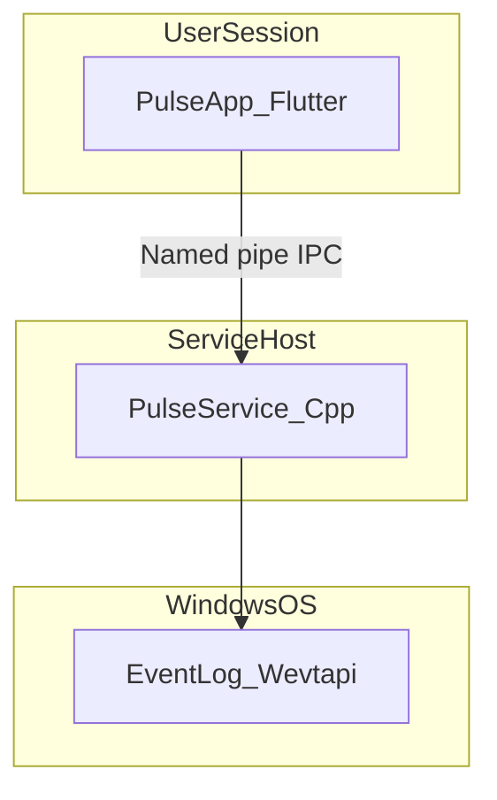
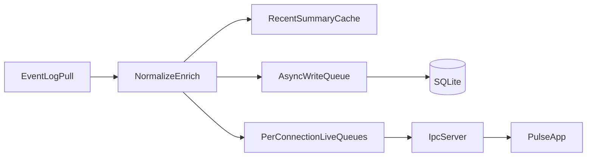

# 01 — System Overview

## Purpose

Pulse is a read-only Windows observability platform. v1 proves one stable pipeline:

**Windows Event Log → Collector → IPC → Timeline → Human-readable events.**

Pulse never modifies operating system behavior.

---

## High-Level Architecture

Two processes:

1. **PulseService** — C++20 Windows Service: Event Log pull, normalize/enrich, async persist, IPC
2. **PulseApp** — Flutter Desktop: I/O isolate for pipes, timeline UI (Level 1 first)

ETW, WMI, and plugins are **out of v1 scope**. See future docs [20](20-etw-integration.md), [22](22-wmi-integration.md), [14](14-plugins-future.md).

---

## Design Principles (Non-Negotiable)

| Principle | Implication |
|-----------|-------------|
| Read-only | No writes to registry, files, services, or processes (except Pulse’s own data) |
| Local-first | All data stays on the machine |
| Offline capable | No network required |
| No telemetry | No analytics, tracking, or cloud |
| Observation only | No injection, hooks, patches |
| Simplicity first (v1) | One source, one proven pipeline |
| Fast startup | UI target: under 1 second cold start |
| Responsive | Hot path never blocked on disk or slow clients |

---

## Process Responsibilities

### PulseService

- Runs as a Windows Service
- Owns Event Log pull subscriptions (Wevtapi)
- Normalizes and enriches into `PulseEvent` (Level 1 + 2 always; Level 3 lazy)
- Recent summary cache + **per-connection live queues**
- Async SQLite writer for durable history
- Named pipe IPC server

### PulseApp

- Connects on launch via I/O isolate
- Renders virtualized timeline (Level 1 in list)
- Detail pane: Level 2 always; Level 3 on expand (fetch)
- Does not call Windows diagnostic APIs

---

## Hot Path vs Cold Path

| Path | What | Rules |
|------|------|-------|
| **Hot** | Pull → normalize → enrich → cache → live queues → notify | No SQLite wait; no full XML render required |
| **Cold** | Async writer → SQLite (+ optional raw store) | May lag; detail/history use this |

---

## Trust Boundaries

| Boundary | Rule |
|----------|------|
| Service ↔ Windows | Read-only Wevtapi |
| Service ↔ UI | Named pipe with documented SDDL; Protobuf |
| Service ↔ Storage | Local files under `%ProgramData%\Pulse\` |

---

## Privilege Model (v1)

| Capability | Account | Notes |
|------------|---------|-------|
| Service install | Administrator (once) | `PulseService.exe --install` |
| Service runtime | `NT AUTHORITY\LocalService` | Default |
| Event Log Admin/Operational | LocalService | Typical channels |
| Security channel | Not required for v1 | Optional later |

No ETW/kernel elevation paths in v1.

---

## Performance Targets

| Metric | Target |
|--------|--------|
| UI cold start | < 1 second |
| Idle RAM (combined) | < 150 MB (measure early; Flutter dominates) |
| Idle CPU | Near zero |
| Timeline scroll | 60 FPS |
| Hot-path event → live queue | < 10 ms p95 (Event Log rates) |
| IPC live push | < 50 ms p95 under normal Event Log load |

---

## Failure Modes

| Failure | Behavior |
|---------|----------|
| Service crash | SCM restart; UI reconnects; in-memory cache lost; SQLite intact |
| UI crash | Service continues |
| Slow UI client | That connection’s live queue drops oldest; **ingest continues** |
| SQLite write failure | Hot path continues; health warning; retry writer |
| Disk full | Stop cold writes; live continues; banner in UI |

---

## Related Documents

- [02 — Module Boundaries](02-module-boundaries.md)
- [08 — Data Flow](08-data-flow.md)
- [21 — Event Viewer Integration](21-event-viewer-integration.md)
- [ADR-007](decisions/ADR-007-event-log-only-v1.md)
- [ADR-008](decisions/ADR-008-hot-cold-live-queues.md)
