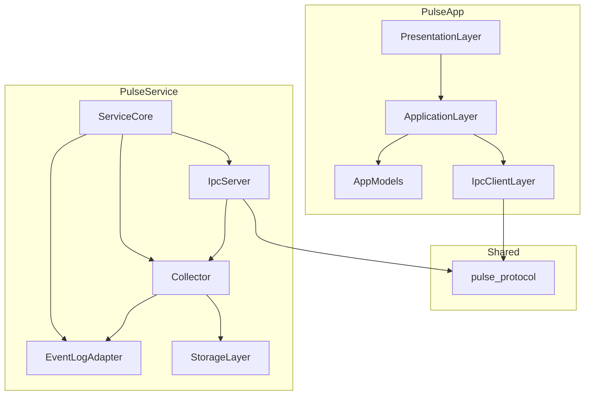

# 02 — Module Boundaries

## Purpose

Clear ownership and dependency rules for Pulse **v1** (Event Log only).

---

## Module Map



**v1 naming:** Prefer a single **Collector** module exposing Event Engine (ingest) and Timeline (query/live) *interfaces*, implemented in one place until query complexity grows. Conceptually they remain separate; physically avoid premature dual-subsystem orchestration.

---

## Service Modules

### ServiceCore

**Owns:** SCM lifecycle, config, shutdown, health orchestration.

**Must not:** Parse events, own IPC framing, call Wevtapi directly.

---

### EventLogAdapter (sole v1 adapter)

**Owns:** Wevtapi pull subscriptions, channel config, bookmarks, enqueue of raw observations.

**Interface:** `ISourceAdapter` (kept for future ETW/WMI adapters — **not implemented** in v1).

**Must not:** Talk to IPC, SQLite, or UI. Must not write to Windows (except Pulse bookmark files).

**v1 only adapter.** No `EtwAdapter`, `WmiAdapter` binaries or build targets in v1.

---

### Collector (Event ingest + Timeline queries)

**Owns:**

- Hot path: MPSC dequeue → normalize → dedupe → enrich → summary cache → per-connection live enqueue
- Cold path handoff: enqueue durable write jobs
- Query API: `SubscribeLive`, `QueryRange`, `GetEvent` (Level 3 may trigger lazy raw load)

**Depends on:** EventLogAdapter (callback/queue), StorageLayer.

**Must not:** Call Wevtapi; block on SQLite in hot path; call IPC write APIs synchronously from ingest.

---

### StorageLayer

**Owns:**

- Recent summary cache (single-writer)
- Async SQLite writer thread
- Optional raw payload store (lazy Level 3)
- Retention purge

**Must not:** Enrich events or implement IPC.

---

### IpcServer

**Owns:** Named pipe, SDDL, framing, request routing, draining **per-connection live queues** onto the wire.

**Depends on:** Protocol, Collector query/subscribe API.

**Must not:** Call Wevtapi; pull from a shared ring head.

---

## App Modules

Unchanged layers: Presentation → Application → IpcClient → Protocol.

**IpcClientLayer** must run pipe I/O on a **dedicated Dart isolate**.

---

## Dependency Rules

### Allowed

```
Presentation → Application → IpcClient → Protocol
IpcServer → Collector → Storage
Collector → EventLogAdapter
ServiceCore → Collector, IpcServer, EventLogAdapter
```

### Forbidden

| From | To | Reason |
|------|-----|--------|
| EventLogAdapter | IpcServer, Storage | Emit upward only |
| Presentation | IpcClient | Via Application |
| PulseApp | Wevtapi | Observation only in service |
| Collector hot path | SQLite sync write | Async writer only |
| Ingest thread | Blocking IPC write | Per-conn queues + IPC workers |

---

## Queues (Concurrency Contracts)

| Queue | Producers | Consumers | Type |
|-------|-----------|-----------|------|
| Adapter → ingest | Event Log pull thread(s) / pool handoff | Single ingest thread | **MPSC** |
| Ingest → SQLite writer | Ingest | Writer thread | SPSC or MPSC bounded |
| Ingest → per-connection live | Ingest | That connection’s IPC worker | SPSC per connection |

No shared ring **consumer head**. See [11 — Threading](11-threading.md).

---

## Future Adapters (Not Built in v1)

When M2/M3 arrive, they implement `ISourceAdapter` and feed the same MPSC ingest queue. Docs: [20](20-etw-integration.md), [22](22-wmi-integration.md).

---

## Related Documents

- [06 — Event Engine](06-event-engine.md)
- [07 — Timeline Engine](07-timeline-engine.md)
- [15 — Folder Structure](15-folder-structure.md)
