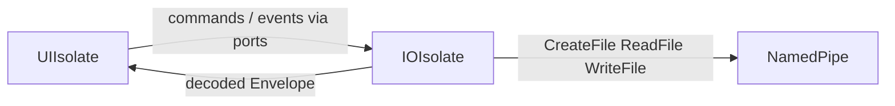

# 03 — Flutter Architecture

## Purpose

Structure of PulseApp for **v1**: Event Log timeline over named-pipe IPC.

---

## Technology Stack

| Component | Choice |
|-----------|--------|
| Framework | Flutter Desktop (Windows) |
| Language | Dart 3.x |
| IPC | Named pipe via FFI/`win32` on a **dedicated I/O isolate** |
| Serialization | Protobuf (generated) |
| State | Immutable models + controllers / streams |

---

## Critical Rule: I/O Isolate

**Never** call synchronous `ReadFile` / `WriteFile` FFI on the UI isolate.



| Isolate | Owns |
|---------|------|
| UI | Widgets, controllers, 60 FPS |
| I/O | Pipe connect, framing, Protobuf encode/decode, reconnect |

If IPC work is placed on the UI isolate, the architecture is non-compliant.

---

## Layers

```
presentation/   → application/ → ipc/ → models/ + generated/
```

Same folder layout as previously documented under `apps/pulse_app/lib/`. Settings UI in v1 is minimal: connection status, channel list (read-only from health), About.

---

## Timeline UI

- Virtualized list; Level **1 only** in rows
- Detail pane: Level 2; Level 3 on expand → `GetEvent` (may trigger lazy raw fetch)
- Debounced search/filter (simple server filters in v1; FTS optional later)
- Connection StatusBar with human errors

---

## State / Connection

```
Disconnected → Connecting → Connected
            ↘ Error → Reconnecting (backoff)
```

On reconnect: `QueryRange` gap fill from last seen timestamp, then `SubscribeLive`.

---

## Theme

Dark-mode-first; whitespace; minimal icons; no clutter. Light mode later.

---

## v1 Screens

| Screen | Purpose |
|--------|---------|
| Timeline | Primary |
| Event Detail | Side panel Level 2 / 3 |
| Settings | Service status, enabled channels (display) |
| About | Version |

No multi-source dashboards.

---

## Related Documents

- [05 — IPC](05-ipc.md)
- [11 — Threading](11-threading.md)
- [ADR-008](decisions/ADR-008-hot-cold-live-queues.md)
