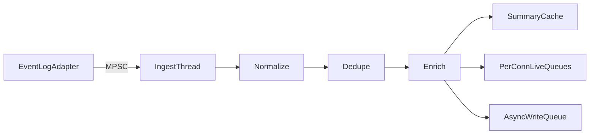

# 06 — Event Engine (Collector Ingest)

## Purpose

Hot-path ingest for **v1: Event Log only**. Normalize, dedupe, enrich, fan out to live queues and async storage.

---

## Pipeline

---

## Stages

### 1. Receive (MPSC)

EventLogAdapter enqueues `RawObservation` into an **MPSC** queue (Wevtapi/pull handoff may involve multiple threads — never assume SPSC).

Capacity: 10,000. Overflow: drop oldest + counter.

### 2. Normalize

`EventLogNormalizer` only in v1. Maps channel, provider, EventID, level, record id, computer, message fields → `PulseEvent` with Level 1/2 placeholders then enrichment; **Level 3 not required on hot path**.

### 3. Deduplicate

Key: `channel + record_id`. Window: 60s LRU.

### 4. Enrich

Rule-based Level 1 / Level 2.

**Defaults embedded in the binary** (or sealed assets next to the EXE). Optional overrides in `%ProgramData%\Pulse\rules\` — never rely on ProgramData for core UX.

### 5. Fan-out (hot)

1. Insert summary into recent summary cache (single-writer)
2. Push summary to each subscribed connection’s live queue (non-blocking)
3. Enqueue durable write job (summary + metadata; raw optional)

### 6. Cold persist (async)

Writer thread batches inserts into SQLite. Failures do not stall ingest.

---

## Adapter Interface (v1)

Only `EventLogAdapter` is constructed. `ISourceAdapter` remains the extension point for future milestones.

---

## Error Isolation

| Failure | Behavior |
|---------|----------|
| Parse error | Store/emit with `parse_error`; continue |
| Enrichment miss | Fallback Level 1/2 from rendered message |
| Live queue full | Drop for that client only |
| Writer failure | Retry; health warning; hot path continues |

---

## Metrics

Received, normalized, deduped, live dropped (per conn), writer queue depth, writer errors.

---

## Related Documents

- [07 — Timeline](07-timeline-engine.md)
- [10 — Storage](10-storage.md)
- [21 — Event Viewer](21-event-viewer-integration.md)
- [ADR-008](decisions/ADR-008-hot-cold-live-queues.md)
