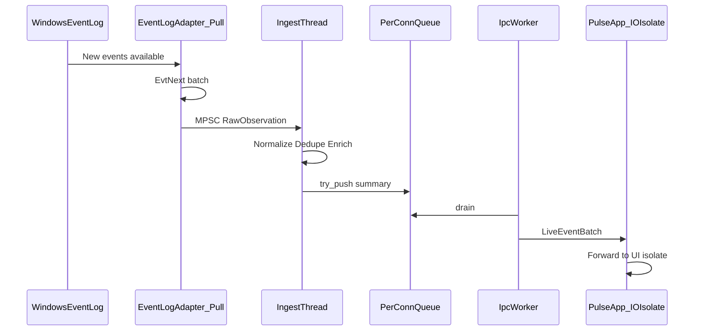
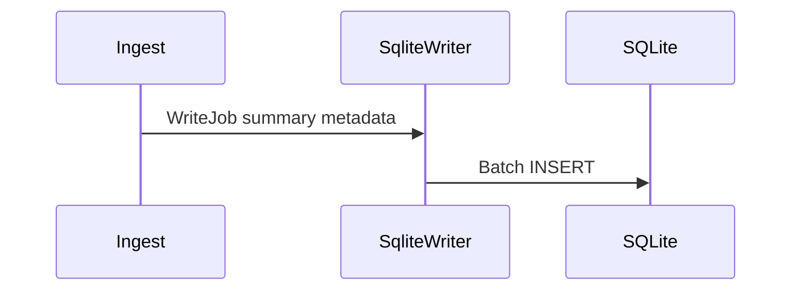
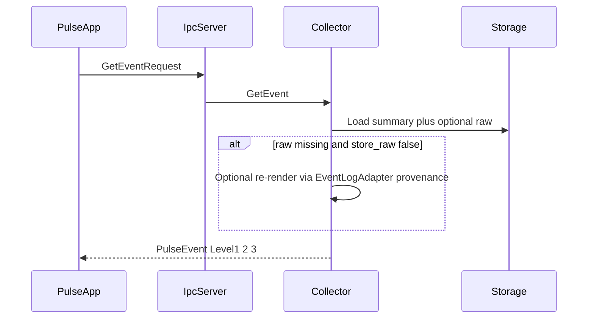

# 08 — Data Flow

## Purpose

End-to-end path for **v1 Event Log only**.

---

## Live Path (Hot)

**Latency budget (Event Log rates):** pull/normalize/enrich/enqueue under 10 ms p95; IPC to UI under 50 ms p95 under normal load.

Ingest **does not** wait for SQLite or pipe writes.

---

## Cold Persist Path

---

## Detail Path (Lazy Level 3)

---

## Example: Application Error 1000

1. Pull delivers event from Application channel  
2. Normalize extracts process / exception fields  
3. Embedded rule → Level 1: “{process} stopped responding and was closed.”  
4. Level 2: technical Application Error summary  
5. Summary pushed to live subscribers  
6. Writer persists index row (XML later or on demand)

---

## Related Documents

- [06 — Event Engine](06-event-engine.md)
- [21 — Event Viewer Integration](21-event-viewer-integration.md)
