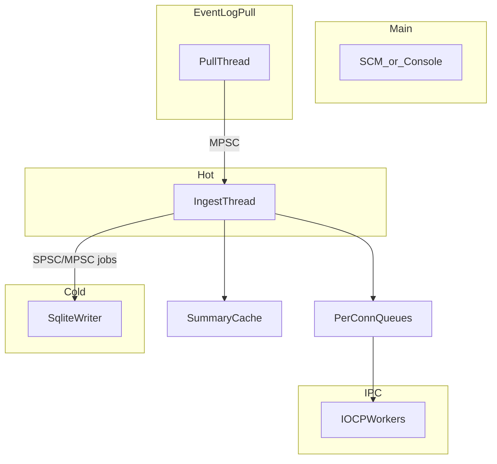

# 11 — Threading Model

## Purpose

Thread and concurrency contracts for **v1 Event Log pipeline**, including accepted P0 fixes.

---

## PulseService Threads

| Thread | Role |
|--------|------|
| Main / SCM | Lifecycle |
| Event Log pull | `EvtSubscribe` pull wait + `EvtNext` batches; enqueue MPSC |
| Ingest | Normalize, dedupe, enrich, cache, live try_push, writer enqueue |
| SQLite writer | Durable inserts, purge |
| IOCP workers (2) | Pipe I/O; drain per-connection live queues |

No ETW `ProcessTrace` threads. No WMI poll threads.

---

## Concurrency Contracts (P0)

| Path | Contract |
|------|----------|
| Adapter → ingest | **MPSC** (not SPSC) |
| Ingest → each live queue | Single producer (ingest), single consumer (that conn’s IPC path) |
| Live queues | **No shared ring head** |
| SQLite | Single writer thread; readers on IOCP for queries |
| Ingest → IPC | **Never** synchronous pipe write from ingest |

---

## Event Log Pull Thread

Prefer **pull model** ([21](21-event-viewer-integration.md)):

1. Wait on subscription signal
2. `EvtNext` batch
3. Minimal copy / values render for hot path
4. Enqueue MPSC
5. Full XML **not** required here (lazy Level 3)

If a push callback is used temporarily, it must only enqueue opaque data and must treat producers as MPSC — still prefer pull for v1.

---

## PulseApp Isolates

| Isolate | Work |
|---------|------|
| UI | Widgets, controllers |
| I/O | All named-pipe FFI, framing, Protobuf |

Sync FFI on UI isolate is an architecture violation.

---

## Shutdown

Stop accepting IPC → stop pull → drain MPSC → stop ingest → drain writer → join → `SERVICE_STOPPED`.

---

## Related Documents

- [05 — IPC](05-ipc.md)
- [06 — Event Engine](06-event-engine.md)
- [03 — Flutter](03-flutter-architecture.md)
- [ADR-008](decisions/ADR-008-hot-cold-live-queues.md)
