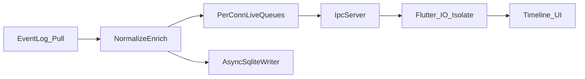

# Architecture Review — Pulse v1

**Date:** 2026-07-27  
**Updated:** 2026-07-27 — **P0 recommendations accepted**; architecture docs revised for Event Log–only v1  

**Scope:** Review of original `docs/architecture/` (01–22 + ADRs), then remediation  

**Mode:** Challenge decisions; remediation is documentation-only (no production code)

---

## Remediation Status

| ID | Recommendation | Status |
|----|----------------|--------|
| P0-1 | Per-connection live queues; no shared ring head | **Accepted** — see ADR-008, docs 05/07/10/11 |
| P0-2 | MPSC for Event Log path | **Accepted** — docs 02/06/11/21 |
| P0-3 | Async SQLite writer; hot path off disk | **Accepted** — ADR-008, docs 06/10/11 |
| P0-4 | Event Log pull + lazy Level 3 | **Accepted** — doc 21 |
| P0-5 | Dart I/O isolate for pipes | **Accepted** — docs 03/05/11 |
| Scope | Event Log only; ETW/WMI/plugins out of v1 execution | **Accepted** — ADR-007 |

P1 items partially absorbed where they serve simplicity (raw BLOB off primary table; WMI defaults removed; ETW deferred; embedded enrichment rules).

---

## Historical Verdict (Pre-Remediation)

The original package was directionally correct but not implementation-ready for the full multi-source surface. Primary risks were concurrency and I/O placement.

The sections below preserve the challenge analysis for traceability. **Authoritative current design is the updated 01–22 docs + ADR-007/008**, not the pre-remediation recommendations alone.

---

## Executive Summary (Original)

| Area | Grade | Headline |
|------|-------|----------|
| Product fit / principles | Strong | Read-only, local-first, timeline hierarchy |
| Process split | Strong | Service + UI correct |
| IPC | Good | Named pipes right; harden framing/backpressure |
| Pipeline | Fair | Sync SQLite on ingest was a bottleneck |
| Threading | Weak | SPSC/ring/FFI issues |
| Storage | Fair | Raw BLOB-in-row risk |
| Windows APIs | Mixed | Wevtapi sound; WMI polling wrong; ETW diagram risk |

---

## What Holds Up

1. Windows Service + Flutter client — **Keep**  
2. Named pipes (not HTTP) — **Keep**  
3. Event Log as primary — **Keep; exclusive for v1**  
4. Level 1→2→3 hierarchy — **Keep**  
5. Plugin deferral — **Keep**  
6. C++ collector — **Keep**

---

## P0 — Accepted

| ID | Fix |
|----|-----|
| P0-1 | Per-connection live queues; no shared ring consumer head |
| P0-2 | MPSC Event Log → ingest |
| P0-3 | Async SQLite writer |
| P0-4 | Pull subscribe + lazy Level 3 XML |
| P0-5 | Flutter I/O isolate for pipe FFI |

---

## Current v1 Target Shape

**Objective:** stable end-to-end human-readable Event Log timeline.

---

## Related Documents

- [README](README.md)
- [ADR-007](decisions/ADR-007-event-log-only-v1.md)
- [ADR-008](decisions/ADR-008-hot-cold-live-queues.md)
