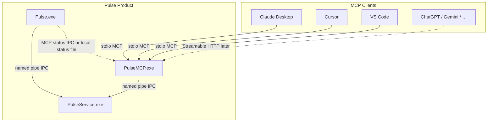

# 33 — PulseMCP Product Architecture & API Surface

**Status:** Architecture accepted — **M1 shipped**; M2–M8 tracked in [34-engineering-roadmap.md](34-engineering-roadmap.md) (R5–R7)  
**ADR:** [ADR-010](decisions/ADR-010-mcp-first-class-product.md)  
**MCP spec:** [2025-11-25](https://modelcontextprotocol.io/specification/2025-11-25/) (and later negotiated versions via SDK)  
**SDK:** Official TypeScript `@modelcontextprotocol/sdk` packaged as `PulseMCP.exe`

---

## 1. Purpose

PulseMCP is a **first-class Pulse product** that exposes Windows diagnostics collected by PulseService to any MCP-compatible AI client.

Pulse does **not** embed an LLM and does **not** require OpenAI/Anthropic/Google API keys.

| Binary | Responsibility |
|--------|------------------|
| `Pulse.exe` | Human UI; Settings opt-in; **MCP Diagnostics** pane |
| `PulseService.exe` | Windows APIs, collectors, timeline, health |
| `PulseMCP.exe` | Official MCP server; tool/resource adapters; MCP logs & metrics |

---

## 2. Design principles

1. **Official MCP only** — no custom AI wire protocol.
2. **Observation first** — v1 registers only Observation-tier tools/resources.
3. **Structured JSON** — tools return machine JSON; AI formats prose.
4. **Namespaces** — `system.*`, `process.*`, `timeline.*`, `diagnostics.*`, `report.*`, `service.*`, `mcp.*`.
5. **Subscribe, don’t poll** — live Resources for hot metrics and timeline.
6. **Pulse owns reports** — `report.export` writes files; model receives paths.
7. **Independent product health** — PulseMCP version/uptime/metrics independent of UI and service.
8. **Forward-compatible** — Prompts, Sampling, Streamable HTTP, Auth plug in without redesign.

---

## 3. Process topology



### Versioning

| Artifact | Version source |
|----------|----------------|
| Pulse UI | `apps/pulse_app/pubspec.yaml` + `kAppVersion` |
| PulseService | `kServiceVersion` / `version.hpp` |
| PulseMCP | `apps/pulse_mcp/package.json` → stamped into EXE + `mcp.server.version` |

Versions **may diverge** across milestones; Diagnostics shows all three.

### Lifecycle

1. User enables **MCP bridge** in Settings (default **off**).
2. Installer places `PulseMCP.exe` under `Program Files\Pulse\`.
3. AI client config launches `PulseMCP.exe` (stdio). PulseMCP connects to `\\.\pipe\PulseService`.
4. If service is down, tools return structured error `pulse.service_unavailable` (MCP error + JSON body).
5. PulseMCP does **not** elevate or start the service; UI remains responsible for SCM/UAC.

### Pipe capacity

Raise `kMaxPipeInstances` from **4 → 8** so concurrent UI + MCP + future clients do not exhaust slots. Framing and Protobuf schema stay at protocol v1 unless a later ADR adds fields.

---

## 4. Permission model

Every tool and resource declares a **permission level**:

| Level | Meaning | v1 |
|-------|---------|----|
| `observation` | Read live/snapshot diagnostics already collected | **Registered** |
| `read_only` | Read additional local artifacts (exports, logs) without changing OS | Reserved / selective |
| `administrative` | Would require elevation or mutate system state | **Not registered** |
| `experimental` | Unstable schemas | Not registered in release builds |

v1 policy: **only `observation`** tools and resources are advertised in `tools/list` / `resources/list`.

Future example (not v1): `process.kill` → `administrative`.

---

## 5. Transport strategy

| Phase | Transport | Binding | Auth |
|-------|-----------|---------|------|
| v1 | **stdio** | Client-spawned subprocess | OS process identity |
| Later | **Streamable HTTP** | `127.0.0.1` only | Bearer token + `Origin` validation + MCP session id |

AGENTS.md “no HTTP for local communication” applies to **Flutter ↔ PulseService**. MCP Streamable HTTP is a separate AI↔PulseMCP boundary and must remain loopback-hardened per MCP security guidance.

---

## 6. MCP capabilities (server)

PulseMCP declares support for:

| Capability | v1 | Notes |
|------------|----|-------|
| Tools | Yes | Namespaced Observation tools |
| Resources | Yes | Live + static snapshots |
| Resource subscriptions | Yes | Health series + timeline |
| Prompts | Stub / empty list | Ready to add without redesign |
| Sampling | Not used by server | Client-driven; architecture leaves hooks |
| Logging (MCP notifications) | Optional | Map to stderr + MCP log file |

---

## 7. Namespaces & catalog

### 7.1 Tools (v1)

| Name | Permission | Expected latency | Primary IPC |
|------|------------|------------------|-------------|
| `system.health` | observation | &lt; 200 ms | `GetHealthSnapshot` |
| `system.cpu` | observation | &lt; 100 ms | Health sample / cache |
| `system.memory` | observation | &lt; 100 ms | Health sample |
| `system.gpu` | observation | &lt; 150 ms | Health sample |
| `system.storage` | observation | &lt; 200 ms | Volumes / disks |
| `system.network` | observation | &lt; 150 ms | Network sample |
| `process.list` | observation | &lt; 300 ms | Process inventory |
| `process.details` | observation | &lt; 250 ms | `GetProcessDetails` |
| `process.search` | observation | &lt; 300 ms | Inventory filter |
| `timeline.list` | observation | &lt; 500 ms | `GetTimelineSnapshot` |
| `timeline.search` | observation | &lt; 800 ms | Snapshot + client-side/service filters |
| `diagnostics.snapshot` | observation | &lt; 200 ms | `GetDiagnosticsSnapshot` |
| `report.export` | observation* | 1–10 s | Snapshots + local formatters |
| `service.status` | observation | &lt; 100 ms | Diagnostics identity / SCM fields |
| `mcp.self` | observation | &lt; 50 ms | PulseMCP internal metrics |

\* `report.export` writes under the user’s Pulse export directory (local artifact). Permission remains observation of diagnostics; it does not mutate Windows. Classify as `read_only` if product policy prefers separating “write files” — **default for v1: `observation` with explicit `sideEffects: ["write_user_export_dir"]` in metadata.**

### 7.2 Reserved (not registered in v1)

| Name | Permission | Notes |
|------|------------|-------|
| `process.kill` | administrative | Future |
| `service.control` | administrative | Never confuse with PulseService SCM UAC path |

### 7.3 Resources (v1)

| URI | Name | Subscribable | Update cadence |
|-----|------|--------------|----------------|
| `pulse://system/cpu` | CPU | Yes | ~1 Hz when subscribed |
| `pulse://system/memory` | Memory | Yes | ~1 Hz |
| `pulse://system/gpu` | GPU | Yes | ~1 Hz |
| `pulse://system/network` | Network | Yes | ~1 Hz |
| `pulse://system/health` | Full health snapshot | Yes | On sample |
| `pulse://timeline/live` | Live timeline events | Yes | On event (batched) |
| `pulse://diagnostics/snapshot` | Diagnostics | Optional | On change / 5 s |
| `pulse://mcp/status` | MCP self status | Yes | On metric tick |

Resource contents are **JSON** (`application/json` MIME). Subscriptions push updates via MCP resource-updated notifications (SDK primitives); PulseMCP fans in from existing `HealthUpdate` / live timeline IPC pushes — **no second collector**.

---

## 8. Tool metadata contract

Every registered tool exposes (in description + `annotations` / `_meta` as supported by the SDK version):

```json
{
  "name": "system.cpu",
  "description": "Latest CPU utilization and topology fields from PulseService.",
  "permission": "observation",
  "expectedLatencyMs": { "p50": 40, "p95": 100, "timeout": 3000 },
  "sideEffects": [],
  "filters": [],
  "inputSchema": { "$ref": "#/schemas/SystemCpuInput" },
  "outputSchema": { "$ref": "#/schemas/SystemCpuResult" },
  "examples": [
    { "arguments": {}, "note": "Current CPU snapshot" }
  ]
}
```

Rules:

- `description` must state **what Windows data** is returned and that values may be `null` when unsupported.
- Never invent metrics; use `null` + optional `unavailableReason`.
- `expectedLatencyMs` is advisory for model routing.

---

## 8a. Cross-cutting API contracts (required)

### Semantic versions in `mcp.self`

| Field | Meaning |
|-------|---------|
| `versions.mcpProtocol` | MCP spec version this server speaks (e.g. `2025-03-26` / negotiated) |
| `versions.mcpServer` | PulseMCP semver (`package.json`) |
| `versions.pulseApp` | Pulse product/UI version stamp when known |
| `versions.pulseService` | From `ServerHello` / `Pong` |
| `versions.ipcProtocol` | Pulse IPC `kProtocolVersion` (integer, currently `1`) |

Clients use these to detect incompatibility immediately.

### Capability discovery (`mcp.self.data.capabilities`)

```json
{
  "tools": ["mcp.self", "system.health", "…"],
  "resources": ["pulse://system/cpu", "…"],
  "subscriptions": ["pulse://system/cpu", "…"],
  "reportFormats": ["json", "html", "pdf", "markdown", "csv"],
  "permissions": ["observation"],
  "protocolFeatures": [
    "tools",
    "resources",
    "resource_subscriptions",
    "structured_json",
    "stdio"
  ]
}
```

Future: append `streamable_http`, `prompts`, `sampling`, `oauth` without removing prior keys.

### Stable identifiers

| Object | Required IDs |
|--------|----------------|
| Process | `pid`, `createTime` (FILETIME/ISO when known), composite `id` |
| Disk / volume | `deviceId` and/or volume GUID |
| GPU | `adapterLuid` (string form) |
| Network adapter | `interfaceGuid` |
| Timeline event | `eventGuid` / wire `eventId` |

Display names are labels only — never the sole key.

### Pagination

Collection tools (`process.list`, `timeline.list`, `timeline.search`, …) accept:

| Param | Meaning |
|-------|---------|
| `limit` | Max items (server clamps; default 50, max 500) |
| `offset` | Zero-based skip (optional) |
| `cursor` | Opaque resume token (preferred over large offsets) |

Responses include `count`, `truncated`, `nextCursor` (nullable).

### Filtering

Every collection tool documents filters (see §10). Unsupported filters return `INVALID_ARGUMENTS` with details — they are not silently ignored when explicitly set to unsupported values.

### Resource lifecycle (publish rules)

| Resource | When to publish | Skip if |
|----------|-----------------|---------|
| `pulse://system/cpu` | ~1 Hz while subscribed | Payload deep-equal to last publish |
| `pulse://system/memory` | ~1 Hz | unchanged |
| `pulse://system/gpu` | ~1 Hz | unchanged |
| `pulse://system/network` | ~1 Hz | unchanged |
| `pulse://system/health` | on HealthUpdate sample | unchanged |
| `pulse://timeline/live` | event-driven (batched ≤100 ms) | empty batch |
| `pulse://diagnostics/snapshot` | on change (poll ≤5 s) | unchanged |
| `pulse://mcp/status` | on metric tick (≤2 s) | unchanged |

### Errors (structured only)

```json
{
  "ok": false,
  "tool": "process.details",
  "code": "PROCESS_NOT_FOUND",
  "message": "No process with pid 99999.",
  "details": { "pid": 99999 },
  "observedAt": "2026-08-01T16:00:00.000Z",
  "generatedAt": "2026-08-01T16:00:00.010Z"
}
```

Stable codes (non-exhaustive): `SERVICE_UNAVAILABLE`, `TIMEOUT`, `INVALID_ARGUMENTS`, `PROCESS_NOT_FOUND`, `PERMISSION_DENIED`, `UNSUPPORTED`, `POLICY_DISABLED`, `INTERNAL`.

### Timestamps

| Field | Meaning |
|-------|---------|
| `observedAt` | When the underlying data was observed (sample/event time) |
| `generatedAt` | When PulseMCP built this response |

Cached IPC data must still set both so models can detect staleness (`generatedAt - observedAt`).

### Backward compatibility

- Never rename registered tool names.
- Never remove required JSON fields; deprecate then tombstone across a major MCP API version.
- Additive fields and new tools are allowed on the same major.
- Incompatible schema changes → bump PulseMCP major + document migration in release notes.

### Testing requirements

For **every** implemented tool:

1. **Unit tests** — schema, filters, pagination, error codes, redaction.
2. **IPC integration tests** — against live `PulseService` (skip/xfail only when pipe absent; CI with `--console`).
3. **MCP integration tests** — `tools/list` + `tools/call` via SDK client over stdio.

---

## 9. Common JSON envelope

Success:

```json
{
  "ok": true,
  "tool": "system.cpu",
  "permission": "observation",
  "observedAt": "2026-08-01T16:00:00.000Z",
  "generatedAt": "2026-08-01T16:00:00.012Z",
  "pulse": {
    "serviceVersion": "0.2.0-beta",
    "mcpVersion": "0.1.0",
    "ipcProtocolVersion": 1
  },
  "data": { }
}
```

Error: see §8a (flat `code` / `message` / `details`). Legacy nested `error` objects are **not** used.

Stable error codes map to §8a names (prefer `SERVICE_UNAVAILABLE` over dotted `pulse.service_unavailable` in the JSON `code` field; dotted forms may appear in logs only).

| Code | Meaning |
|------|---------|
| `SERVICE_UNAVAILABLE` | Pipe connect/handshake failed |
| `TIMEOUT` | IPC exceeded timeout |
| `INVALID_ARGUMENTS` | Schema validation failed |
| `PROCESS_NOT_FOUND` | PID missing |
| `PERMISSION_DENIED` | Tool not allowed at current policy |
| `POLICY_DISABLED` | MCP bridge disabled in Settings |
| `UNSUPPORTED` | Field/collector not available |
| `INTERNAL` | Unexpected PulseMCP failure |

MCP transport may also return JSON-RPC errors; tool handlers still return the structured JSON body in `content` / `structuredContent` when possible.

---

## 10. Domain schemas (normative sketches)

Types use JSON Schema draft 2020-12. `null` allowed for unsupported sensors.

### 10.1 `system.health`

**Input:** `{ "sections": ["cpu","memory","gpu","storage","network","static"]? }`

**Data:**

```json
{
  "static": {
    "os": { "name": "string", "build": "string|null", "architecture": "string|null" },
    "cpu": { "name": "string|null", "cores": "number|null", "logicalProcessors": "number|null" },
    "memory": { "totalBytes": "number|null" },
    "gpu": [{ "name": "string|null", "driverVersion": "string|null" }]
  },
  "sample": {
    "cpu": { "$ref": "SystemCpuResult" },
    "memory": { "$ref": "SystemMemoryResult" },
    "gpu": { "$ref": "SystemGpuResult" },
    "storage": { "$ref": "SystemStorageResult" },
    "network": { "$ref": "SystemNetworkResult" }
  }
}
```

### 10.2 `system.cpu`

```json
{
  "usagePercent": 14.2,
  "userKernelPercent": 4.1,
  "usageUserPercent": 10.1,
  "logicalProcessors": 12,
  "frequencyMHz": 4582,
  "temperatureCelsius": null,
  "unavailable": { "temperatureCelsius": "Not supported" }
}
```

### 10.3 `system.memory`

```json
{
  "totalBytes": 34225520640,
  "inUseBytes": 21000000000,
  "availableBytes": 13000000000,
  "usagePercent": 61.4,
  "commitTotalBytes": null,
  "commitLimitBytes": null,
  "pooledPagedBytes": null,
  "pooledNonPagedBytes": null,
  "compressedBytes": null
}
```

### 10.4 `system.gpu`

```json
{
  "adapters": [
    {
      "index": 0,
      "name": "string|null",
      "usagePercent": 12.0,
      "dedicatedMemoryBytes": null,
      "sharedMemoryBytes": null,
      "temperatureCelsius": null,
      "driverVersion": "string|null",
      "engines": [{ "name": "string", "usagePercent": "number|null" }]
    }
  ]
}
```

### 10.5 `system.storage`

```json
{
  "volumes": [
    {
      "mount": "C:\\",
      "label": "string|null",
      "totalBytes": "number|null",
      "freeBytes": "number|null",
      "usagePercent": "number|null",
      "fileSystem": "string|null"
    }
  ],
  "physicalDisks": [
    {
      "model": "string|null",
      "activeTimePercent": "number|null",
      "readBytesPerSec": "number|null",
      "writeBytesPerSec": "number|null",
      "temperatureCelsius": "number|null"
    }
  ]
}
```

### 10.6 `system.network`

```json
{
  "adapters": [
    {
      "name": "string|null",
      "ipv4": ["string"],
      "linkSpeedBitsPerSec": "number|null",
      "receiveBytesPerSec": "number|null",
      "sendBytesPerSec": "number|null"
    }
  ],
  "totals": {
    "receiveBytesPerSec": "number|null",
    "sendBytesPerSec": "number|null"
  }
}
```

### 10.7 `process.list` / `process.search`

**Input filters:**

```json
{
  "cpuAbove": 5.0,
  "memoryAboveBytes": 104857600,
  "company": "string?",
  "signed": true,
  "running": true,
  "applicationOnly": false,
  "backgroundOnly": false,
  "systemOnly": false,
  "nameContains": "string?",
  "limit": 50,
  "sortBy": "cpu|memory|name|pid",
  "sortDir": "desc|asc"
}
```

**Data:**

```json
{
  "count": 12,
  "truncated": false,
  "processes": [
    {
      "pid": 1234,
      "name": "chrome.exe",
      "path": "string|null",
      "cpuPercent": 8.2,
      "workingSetBytes": 200000000,
      "privateBytes": null,
      "company": "string|null",
      "description": "string|null",
      "signed": "boolean|null",
      "hasWindow": "boolean|null",
      "integrity": "string|null"
    }
  ]
}
```

`process.search` accepts the same filters plus required `query` (matches name/path/company).  
`process.list` is the filtered inventory without requiring `query`.

### 10.8 `process.details`

**Input:** `{ "pid": 1234 }`

**Data:** cmdline, parentPid, user, elevation, architecture, startTime, plus live counters when available. Secret-like tokens in cmdline are **redacted** (`***`).

### 10.9 `timeline.list` / `timeline.search`

**`timeline.list` input:** `{ "limit": 50, "cursor": "string?" }`

**`timeline.search` input:**

```json
{
  "severity": ["info","warning","error","critical"],
  "category": "string?",
  "process": "string?",
  "provider": "string?",
  "eventId": "number?",
  "keyword": "string?",
  "from": "ISO-8601?",
  "to": "ISO-8601?",
  "limit": 100
}
```

**Event object:**

```json
{
  "id": "string",
  "observedAt": "ISO-8601",
  "severity": "info|warning|error|critical|verbose|unknown",
  "title": "string",
  "summary": "string",
  "technical": "string|null",
  "channel": "string|null",
  "provider": "string|null",
  "eventId": "number|null",
  "processName": "string|null",
  "pid": "number|null",
  "category": "string|null"
}
```

Level 3 raw XML is **not** included by default (opt-in flag `includeRaw: false` default) to protect privacy and size.

### 10.10 `diagnostics.snapshot`

Maps `DiagnosticsSnapshot`: pipeline stages, queue depths, IPC rates, service identity (path, hash, SCM state), collector flags. Structured JSON only.

### 10.11 `service.status`

v1 scope (**not** full SCM catalog):

```json
{
  "pulseService": {
    "installed": true,
    "running": true,
    "startType": "string|null",
    "version": "string|null",
    "path": "string|null",
    "account": "string|null"
  },
  "catalog": {
    "available": false,
    "reason": "Full Windows service inventory is not collected in this Pulse milestone."
  }
}
```

### 10.12 `report.export`

**Input:**

```json
{
  "template": "health|timeline|diagnostics|hardware|combined",
  "format": "json|html|pdf|markdown|csv",
  "directory": "string?"
}
```

**Data:**

```json
{
  "path": "C:\\Users\\…\\Documents\\Pulse\\Reports\\…",
  "format": "html",
  "template": "health",
  "bytes": 12345,
  "createdAt": "ISO-8601"
}
```

Generation runs **inside PulseMCP** (shared formatting module or invoked helper), using live IPC data — **not** model-authored content.

### 10.13 `mcp.self`

```json
{
  "enabledPolicy": true,
  "uptimeSeconds": 3600,
  "transport": "stdio",
  "versions": {
    "mcpProtocol": "2025-03-26",
    "mcpServer": "0.1.0",
    "pulseApp": "0.2.0-beta",
    "pulseService": "0.2.0-beta",
    "ipcProtocol": 1
  },
  "capabilities": {
    "tools": ["mcp.self"],
    "resources": [],
    "subscriptions": [],
    "reportFormats": ["json", "html", "pdf", "markdown", "csv"],
    "permissions": ["observation"],
    "protocolFeatures": ["tools", "structured_json", "stdio"]
  },
  "connectedClients": 1,
  "requestsServed": 42,
  "requestsFailed": 1,
  "averageLatencyMs": 55,
  "lastRequestAt": "ISO-8601|null",
  "lastRequestTool": "mcp.self|null",
  "activeTools": ["mcp.self"],
  "activeSubscriptions": [],
  "logPath": "string",
  "servicePipeConnected": true,
  "diagnostics": {
    "startedAt": "ISO-8601",
    "pid": 1234,
    "policyPath": "string"
  }
}
```

---

## 11. Flutter — MCP Diagnostics section

Under **Diagnostics** (and mirrored status chip in Settings → Privacy/Developer):

| Field | Source |
|-------|--------|
| MCP enabled | Settings + PulseMCP heartbeat |
| MCP version | `mcp.self` / status file |
| Connected clients | PulseMCP metrics |
| Active tools | Registered Observation set |
| Requests served / failed | Counters |
| Average latency | Rolling window |
| Last request | Tool + timestamp |
| Server uptime | PulseMCP start time |
| Log path | `%LOCALAPPDATA%\Pulse\logs\pulsemcp\…` |
| Pipe to service | Connected / error |

### Status channel (UI ↔ PulseMCP)

Prefer a **local status file + named mutex** or a second lightweight named pipe `\\.\pipe\PulseMCPStatus` owned by PulseMCP (JSON heartbeats every 2 s). Do **not** route AI traffic through Flutter.

If MCP is disabled in Settings, PulseMCP still may be spawned by an AI client; tools should refuse with `pulse.permission_denied` when policy file says disabled (**recommended**), or document that Settings opt-in only controls in-app diagnostics advertising — **product choice locked:** **hard refuse when disabled** (policy file written by UI; PulseMCP reads on each request).

---

## 12. Security & privacy

1. Default **MCP disabled** until user opts in.
2. Observation tools only in v1.
3. Cmdline / path redaction heuristics.
4. Response size caps (e.g. 512 KiB JSON soft limit; timeline `limit` max 500).
5. Rate limits per tool class (timeline/report stricter).
6. Local audit log: time, tool, ok/error, latency, byte size — **not** full payloads by default.
7. Disclosure string in Settings: AI clients may upload tool results to their cloud; Pulse does not.
8. Future HTTP: localhost, Origin check, bearer token ACL’d to user.

---

## 13. Project structure

```
Pulse/
├── apps/
│   ├── pulse_app/                 # Flutter UI (+ MCP Diagnostics)
│   └── pulse_mcp/                 # FIRST-CLASS MCP PRODUCT
│       ├── package.json           # name: @pulse/mcp, version independent
│       ├── tsconfig.json
│       ├── README.md              # Client config recipes
│       ├── schemas/               # JSON Schema files (source of truth)
│       │   ├── common.schema.json
│       │   ├── system.*.schema.json
│       │   ├── process.*.schema.json
│       │   ├── timeline.*.schema.json
│       │   ├── diagnostics.schema.json
│       │   ├── report.schema.json
│       │   └── mcp.self.schema.json
│       ├── src/
│       │   ├── main.ts            # stdio entry
│       │   ├── http.ts            # Streamable HTTP entry (later)
│       │   ├── server/
│       │   │   ├── createServer.ts
│       │   │   ├── registerTools.ts
│       │   │   ├── registerResources.ts
│       │   │   └── metadata.ts
│       │   ├── ipc/
│       │   │   ├── PulseIpcClient.ts
│       │   │   ├── framing.ts
│       │   │   └── codec.ts       # Envelope encode/decode (port or shared)
│       │   ├── tools/
│       │   │   ├── system/
│       │   │   ├── process/
│       │   │   ├── timeline/
│       │   │   ├── diagnostics/
│       │   │   ├── report/
│       │   │   ├── service/
│       │   │   └── mcp/
│       │   ├── resources/
│       │   │   ├── healthResources.ts
│       │   │   └── timelineResources.ts
│       │   ├── reports/           # JSON/HTML/PDF/MD/CSV generators
│       │   ├── policy/            # opt-in gate, permissions
│       │   ├── metrics/           # requests, latency, clients
│       │   ├── logging/           # structured JSON logs
│       │   └── status/            # UI status pipe/file
│       └── test/
├── service/pulse_service/         # unchanged collectors (pipe max bump)
├── shared/pulse_protocol/         # IPC schema shared conceptually
├── tools/scripts/
│   └── package_pulsemcp.ps1       # SEA / bundle → PulseMCP.exe
└── docs/architecture/
    ├── 33-mcp-bridge.md           # this document
    └── decisions/ADR-010-….md
```

Logging directory: `%LOCALAPPDATA%\Pulse\logs\pulsemcp\pulsemcp-YYYYMMDD.jsonl`

Policy file: `%LOCALAPPDATA%\Pulse\mcp\policy.json` (`{ "enabled": false }`)

---

## 14. Client configuration (stdio)

```json
{
  "mcpServers": {
    "pulse": {
      "command": "C:\\Program Files\\Pulse\\PulseMCP.exe",
      "args": []
    }
  }
}
```

Dev:

```json
{
  "mcpServers": {
    "pulse": {
      "command": "node",
      "args": ["C:\\dev\\Pulse\\apps\\pulse_mcp\\dist\\main.js"]
    }
  }
}
```

---

## 15. Implementation roadmap (incremental; start only after explicit go-ahead)

| Phase | Scope | Exit criteria |
|-------|--------|----------------|
| **M0** | Docs locked (ADR-010 + this doc + cross-cutting contracts) | **Done** |
| **M1** | PulseMCP skeleton: version, logging, metrics, stdio, `mcp.self`, policy gate, pipe hello | **Done** (`apps/pulse_mcp`) |
| **M2** | `system.*` tools + health resources + subscriptions | **Frozen** (2026-08-02) — [archives/mcp-m2-validation.md](archives/mcp-m2-validation.md) |
| **M3** | `process.list` / `search` / `details` | Filtered inventory JSON |
| **M4** | `timeline.list` / `timeline.search` + `pulse://timeline/live` | Search filters validated |
| **M5** | `diagnostics.snapshot`, `service.status` | Matches UI diagnostics fields |
| **M6** | `report.export` (json/html/pdf/md/csv) | Files on disk; tool returns path |
| **M7** | Flutter MCP Diagnostics UI + installer + pipe max 8 | Three versions visible in UI |
| **M8** | Streamable HTTP loopback + bearer (optional) | Spec-compliant HTTP transport |
| **Later** | Full service catalog; `process.kill`; Prompts | Separate ADRs |

Each phase: unit tests for schemas, integration test against PulseService `--console`, no fabricated metrics.

---

## 16. Explicit non-goals

- Embedding or calling cloud LLMs from Pulse
- Replacing named-pipe IPC with HTTP for the UI
- Registering Administrative tools in v1
- Returning pre-formatted markdown tables from tools
- Polling-only live design (Resources are mandatory for health streams)
- Inventing installed-software / full driver / full service catalogs without collectors

---

## 16.1 Future MCP — Inventory Engine (ADR-011)

Shipped Inventory domains expose structured IPC snapshots today (`GetInventoryDomain`).

**Schemas registered** under `apps/pulse_mcp/schemas/inventory/` and listed in
`INVENTORY_TOOLS_REGISTERED` (`apps/pulse_mcp/src/catalog/v1.ts`).
**Handlers remain disabled** (`inventoryToolsEnabled: false` in `mcp.self`) until
the MCP Inventory milestone. Active tools stay `mcp.self` only.

| Tool (registered, disabled) | Domain | Stable id |
|-----------------------------|--------|-----------|
| `inventory.services` | Services | SCM service name |
| `inventory.drivers` | Drivers | SCM driver service key |
| `inventory.software` | Software | ProductCode / uninstall key |
| `inventory.usb` | USB | Device Instance ID |
| `inventory.pci` | PCI | Device Instance Path |
| `inventory.displays` | Displays | Device Instance ID |
| `inventory.audio` | Audio | Device Instance ID |
| `inventory.bluetooth` | Bluetooth | Device Instance ID |
| `inventory.printers` | Printers | Spooler printer name |
| `inventory.battery` | Battery | Instance ID or `system_power` |
| `inventory.motherboard` | Motherboard (P2) | Singleton `motherboard` |
| `inventory.bios` | BIOS (P2) | Singleton `bios` |
| `inventory.cpu` | CPU (P2) | Singleton `cpu` |
| `inventory.memory` | Memory modules (P2) | SMBIOS Device Locator string |
| `inventory.storage` | Storage devices (P2) | SetupAPI disk instance ID |
| `inventory.network` | Network adapters (P2) | Adapter GUID string |

P2 domains (motherboard/BIOS/CPU/memory/storage/network) shipped in R3 P2;
schemas registered and disabled the same as P0/P1. Payloads must remain
structured (no UI-formatted strings). Status enum: `available` / `unsupported`
/ `access_denied` / `partial` / `error`.

---

## 17. Related documents

- [ADR-010](decisions/ADR-010-mcp-first-class-product.md)
- [05-ipc.md](05-ipc.md)
- [01-system-overview.md](01-system-overview.md)
- [AGENTS.md](../../AGENTS.md)
