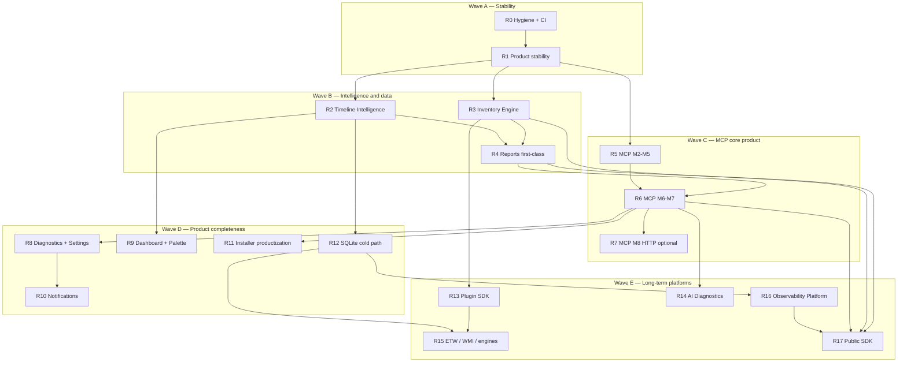

# 34 — Engineering Roadmap (Remaining Work)

**Status:** **Frozen** (approved 2026-08-01)  
**Excludes:** Theme redesign (Fluent Light/Dark / ThemeExtension) — separate track.  
**Constitution:** [AGENTS.md](../../AGENTS.md) — observation only; no fabricated metrics; no collectors without ADRs.

**Change control:** Future work follows this roadmap unless a new ADR explicitly revises direction. Do not reorder waves without an ADR amendment referencing this document.

---

## Vision

> **Pulse is a local-first Windows observability platform providing native diagnostics, historical analysis, extensibility, and AI interoperability through the Model Context Protocol.**

Pulse is not “another Task Manager.” It observes Windows through official APIs, explains what is happening in human language, persists and correlates history over time, exposes itself to assistants via MCP, and eventually offers Plugin and Public SDKs — all without cloud telemetry, embedded LLMs, or mutating the OS.

Single plan for everything remaining after System Health quality, UX redesign (minus theme), and PulseMCP **M1**.

---

## Priority goals (locked)

1. **Product stability before new platform features** — CI, soak, budgets, and release reliability before Inventory / Plugin / AI / Public SDK platforms.
2. **Timeline Intelligence ahead of optional polish** — correlations and grouping before dashboard cosmetics and notifications.
3. **Inventory Engine earlier** — unblocks reports, MCP, and hardware depth.
4. **Reports as a first-class product** — professional multi-format exports.
5. **Long-term Plugin SDK** — out-of-process, ADR-006 aligned.
6. **Long-term AI Diagnostics** — on PulseMCP only; no embedded model or API keys in Pulse.
7. **Streamable HTTP optional** — after core MCP (M2–M7).
8. **Observability Platform (R16)** — long-term product north star (history, RCA, baselines, health scoring).
9. **Public SDK (R17)** — third-party languages against versioned Pulse APIs (distinct from Plugin SDK).

Complexity: **S** ≤2 days · **M** ~1 week · **L** 2–4 weeks · **XL** multi-milestone / new engine.

---

## 0. Baseline (do not re-plan)

| Area | State |
|------|--------|
| CPU / Memory / GPU / Network health panels | Shipped |
| Hardware sensors (storage / SMART-ish / NVMe) | Partial — many Not supported |
| Timeline multi-channel + base intelligence + filters/search | Shipped |
| Diagnostics identity / IPC / FPS | Shipped |
| Process inventory + app grouping (Phase A) | Shipped |
| Service lifecycle (UAC) | Shipped |
| Reports page (4 templates → JSON/CSV/HTML/PDF) | Shipped — deepen in R4 |
| Settings categories | Shipped |
| Ctrl+K + dashboard section layout | Shipped |
| PulseMCP M1 | Shipped |
| ADR-010 + doc 33 | Accepted |

---

## 1. Guiding principles

1. **Stability gates platforms** — Wave A exit before Inventory / Plugin / AI / Public SDK implementation.
2. **Collectors before UI fiction** — inventory-backed surfaces need R3; otherwise `available: false` or omit.
3. **MCP is a peer binary** — tools in PulseMCP; Flutter shows Diagnostics/Settings.
4. **Reports own their milestone** — R4; MCP `report.export` reuses generators.
5. **Additive IPC** — prefer existing envelopes; new messages / pipe limits via ADR.
6. **Observation-only MCP** until an Administrative-tools ADR.
7. **Thin milestones** — code + tests + docs; **success metrics below are the exit gate**.
8. **Observability ≠ Task Manager clone** — every late milestone should advance the Vision (history, correlation, extensibility, MCP).

---

## 2. Waves & recommended order

| Wave | Focus |
|------|--------|
| **A** | Stability — gate for everything else |
| **B** | Timeline Intelligence → Inventory → Reports |
| **C** | MCP M2–M7; optional HTTP |
| **D** | Settings, palette, notifications, installer, SQLite |
| **E** | Plugin SDK, AI Diagnostics, engines, **Observability Platform**, **Public SDK** |

---

## 3. Milestone catalog + success metrics

### Wave A — Product stability

#### R0 — Hygiene, docs drift, CI (S)

| | |
|--|--|
| **Missing** | Status fixes; `pulse_mcp` in CI; full `ctest` |
| **Deps** | None |
| **Risk** | Low |
| **Docs** | 18-testing, 33, ADR-010 status |

**Success metrics (all required):**

- [x] ADR-010 / doc 33 / architecture README status strings match reality (M1 done)
- [x] Doc 25 notes multi-channel Timeline (not “System only”)
- [x] CI runs `flutter test`, `pulse_mcp` `npm test`, and remaining service `ctest` targets on PR
- [x] Doc 34 listed in architecture README index
- [x] No failing tests on `master` CI for the above

**R0 note:** CI also triggers on `master` (repo default) and `main`. Theme redesign files remain uncommitted and out of scope.

#### R1 — Product stability (M–L)

| **Deps** | R0 |
| **Risk** | Medium |
| **Docs** | 03, 25, 27, 30 |

**Success metrics (all required):**

- [x] Cold-start time and idle RSS recorded in release notes (honest vs AGENTS targets)
- [x] Diagnostics (or docs) exposes a budgets checklist: startup, RSS, FPS when Diagnostics open
- [x] Overnight soak (≥8 h) of PulseService + UI with no unexpected process exit; log archived — **PASS** ([archive](archives/r1-soak-pass-2026-08-01.md))
- [x] Dropped-sample or live-queue overflow counters visible where architecture requires them
- [x] `showAdvancedDiagnostics` actually toggles advanced Diagnostics rows
- [x] Layout overflow tests still green; any new overflow fixed
- [x] Clean-VM install smoke of current Setup.exe documented and passed once this train — **accepted at R1 close by maintainer**

**R1 status:** **Complete** (2026-08-01). Engineering + soak PASS + Wave A exit.

**Wave A:** **Frozen / closed.** R0 + R1 complete. Do not reopen Wave A without an ADR.

**Wave B / R2:** **Frozen / closed** (2026-08-02). Maintainer accepted. Evidence: [archives/r2-validation-report-2026-08-02.md](archives/r2-validation-report-2026-08-02.md). Release notes draft: [docs/releases/v0.3.0-beta.md](../releases/v0.3.0-beta.md). **Do not reopen R2 without an ADR.**

**Wave B / R3:** **Frozen / closed** (2026-08-02). Evidence: [archives/r3-inventory-engine-frozen-2026-08-02.md](archives/r3-inventory-engine-frozen-2026-08-02.md). **Do not reopen Inventory Engine without a new ADR. Do not start R4 until product explicitly opens Reports first-class.**

---

### Wave B — Intelligence & data foundation

#### R2 — Timeline Intelligence (L) — flagship Timeline — **COMPLETE / FROZEN**

| **Deps** | R1 |
| **Risk** | Medium (correlation FP) |
| **Docs** | 07-timeline-engine, **[36-timeline-intelligence-r2.md](36-timeline-intelligence-r2.md)**, [38 inventory](38-timeline-intelligence-rules-inventory.md) |
| **Status** | **Complete** (2026-08-02) · frozen |

**Goal:** Timeline is a Pulse flagship surface (incident collapse, RCA hints, Event Viewer–parity details, links, metadata, export, search, 100k+ virtualization) — still Event Log only, deterministic rules only.

**Success metrics (all required):**

- [x] Filters: severity, source/category, provider, process, eventId, date range, keyword — covered by tests
- [x] Flagship search: provider, Event ID, computer, message, XML (when loaded), keyword, process, PID — case-insensitive
- [x] Saved searches persist across restarts
- [x] Bookmarks and pinned events persist and appear in UI
- [x] Correlation links at least one reviewed scenario (same pid/provider window) with documented FP notes
- [x] Incident Timeline: grouping/collapse UI for rule-matched sets (expand/collapse); no fabricated incidents
- [x] Root-cause hints (possible cause, confidence, related, next step) only when a documented rule matches
- [x] Details panel exposes Windows system fields + lazy raw Event XML (Event Viewer parity for the same event)
- [x] Event links: previous/next related, same provider/process/incident when data exists
- [x] Metadata badges: live / bookmarked / pinned / correlated / generated by rule (truthful only)
- [x] Timeline export (JSON + CSV) preserves bookmarks, pins, correlation groups, applied filters, metadata
- [x] Smooth virtualized Timeline at 100,000+ retained events (stable keys; lazy details)
- [x] Intelligence rule coverage expanded vs pre-R2 baseline (count documented in release notes; baseline **38**)
- [x] Validation notes vs Event Viewer / known IDs / providers / channels; every correlation rule documented
- [x] Widget/unit tests for filters + pin/bookmark; no fabricated events
- [x] Light Wevtapi resume persistence **explicitly deferred** (see doc 07 + doc 36)

**Close record:** [archives/r2-validation-report-2026-08-02.md](archives/r2-validation-report-2026-08-02.md) · Rule inventory: [38-timeline-intelligence-rules-inventory.md](38-timeline-intelligence-rules-inventory.md) (**68** rules) · Release notes: [v0.3.0-beta.md](../releases/v0.3.0-beta.md).

#### R3 — Inventory Engine (XL)

**ADR-011 required before code.**

| **Deps** | R1, ADR-011 |
| **Risk** | High |
| **Docs** | **[ADR-011](decisions/ADR-011-inventory-engine.md)** (**Accepted**), 19, 33, **[39-inventory-engine-r3.md](39-inventory-engine-r3.md)** |

**Gate:** ADR-011 Accepted. Implement per ADR + doc 39. R3 complete only when ADR-011 § D11 is satisfied (P0–P2, tests, docs, MCP schemas, report SSOT, release + perf).

**Success metrics (all required for “R3 complete”; phases may ship incrementally):**

- [x] ADR-011 accepted (APIs, PII, refresh, IPC, SSOT, failure model, MCP, reports, perf, testability)
- [x] **Services** inventory implemented and shown in UI
- [x] **Drivers** inventory implemented (ADR subset) and shown in UI
- [x] **Installed software** inventory implemented (documented limits) and shown in UI
- [x] **USB** inventory implemented and shown in UI
- [x] **PCI** inventory implemented and shown in UI
- [x] **P1 domains** (displays, battery, audio, Bluetooth, printers) implemented per ADR-011
- [x] **P2 domains** (motherboard, BIOS, CPU, memory modules, storage, network adapters) implemented per ADR-011
- [x] IPC messages + Flutter surfaces + MCP-ready schemas for shipped domains (handlers disabled until MCP Inventory milestone)
- [x] Reports consume Inventory (Hardware/Software/Driver/Service/System) — no Health bypass *(all templates now Inventory SSOT; System Inventory report added in P2)*
- [x] Spot-check validation vs `services.msc` / Device Manager / Apps & Features recorded — **PASS** ([freeze archive](archives/r3-inventory-engine-frozen-2026-08-02.md), [native capture](../../tools/validation-results/inventory-spotcheck-2026-08-02_11-38-51.md))
- [x] Unit + IPC integration tests per domain; no invented rows; no duplicate collectors *(P0+P1+P2)*
- [x] Performance: lazy start; requested-domain-only; cache contract validated *(P0+P1+P2 smoke; see R3 freeze archive)*
- [x] Release build passes — PulseService Release + Flutter Windows Release (`C:\dev\Pulse-service-build-r3-release`, `apps/pulse_app` Release runner)
- [x] Documentation updated (ADR-011, user-facing inventory limits, 19 API list, doc 33 schemas) *(P0+P1+P2)*

**R3 status (2026-08-02): COMPLETE / FROZEN.** Do not reopen Inventory Engine scope without a new ADR. R4 must not start until product explicitly opens Reports first-class.

#### R4 — Reports first-class (L)

| **Deps** | R1; inventory templates need R3 |
| **Risk** | Medium |
| **Docs** | User Reports guide |

**Success metrics (all required):**

- [ ] Professional shell: branded HTML + PDF + Markdown + JSON + CSV with cover identity (OS/CPU/GPU) and consistent tables
- [ ] System summary / combined executive template from existing Pulse data
- [ ] Markdown first-class in Flutter Reports UI
- [ ] Inventory-backed report templates for services, drivers, installed software (after R3)
- [ ] Shared generators usable by Flutter and PulseMCP (or documented single source of truth)
- [ ] Golden-file or snapshot tests per format
- [ ] Manual visual QA checklist for PDF/HTML signed off in release notes

---

### Wave C — MCP core product

#### R5 — MCP M2–M5 (L)

| **Deps** | R1 |
| **Docs** | 33 schemas |

**Success metrics (all required):**

- [x] Tools live: `system.health`, `system.cpu`, `system.memory`, `system.gpu`, `system.storage`, `system.network` *(M2 frozen 2026-08-02)*
- [x] Tools live: `process.list`, `process.search`, `process.details` with filters + pagination + stable ids *(M3 frozen 2026-08-02)*
- [x] Tools live: `timeline.list`, `timeline.search` with documented filters *(M4 frozen 2026-08-02)*
- [x] Tools live: `diagnostics.snapshot`, `service.status` (PulseService-only until inventory MCP follow-up) — **M5 frozen** ([mcp-m5-validation.md](archives/mcp-m5-validation.md))
- [x] Resources + subscriptions for CPU/Memory/GPU/Network/Health/Timeline/Diagnostics/MCP status; unchanged payloads not published *(M2+M4+M5)*
- [x] Every M2–M5 tool: unit + IPC integration + MCP client test green *(through M5)*
- [x] `mcp.self` capabilities list matches registered tools/resources *(through M5)*
- [x] Structured errors + `observedAt` / `generatedAt` on all tool responses *(through M5)*

#### R6 — MCP M6–M7 productize (L)

| **Deps** | R5; R4 P0 minimum |
| **Docs** | 25, MCP user setup |

**Success metrics (all required):**

- [x] `report.export` writes json/html/pdf/markdown/csv and returns path metadata — **M6 frozen** ([mcp-m6-validation.md](archives/mcp-m6-validation.md))
- [x] Settings AI Integration writes policy; disabled → `POLICY_DISABLED` — **M7 frozen** ([mcp-m7-validation.md](archives/mcp-m7-validation.md))
- [x] Diagnostics MCP section (version, policy, uptime, metrics, subscriptions, log path)
- [x] `PulseMCP.exe` + private `runtime\` + `mcp\` in installer payload (`package_pulsemcp.ps1`)
- [x] Pipe max instances ≥ 8 (`kMaxPipeInstances`)
- [x] Cursor global registration + unregister (Pulse-owned only); Claude Desktop provider; ChatGPT stub
- [x] Privacy / AI disclosure copy in Settings → AI Integration

#### R7 — MCP M8 Streamable HTTP (optional) (XL)

| **Deps** | **R6 complete** |
| **Risk** | High |

**Success metrics (all required if R7 is undertaken):**

- [ ] Binds `127.0.0.1` only
- [ ] Origin validation + bearer auth + session handling per MCP spec
- [ ] Security review recorded (DNS rebinding / token theft checklist)
- [ ] Spec-compliant client smoke test
- [ ] Docs updated; feature flagged or clearly optional in installer/Settings

---

### Wave D — Product completeness

#### R8 — Diagnostics + Settings gaps (M)

**Success metrics:**

- [ ] MCP Diagnostics fields complete vs doc 33 §11
- [ ] Start with Windows works with real APIs (or explicitly omitted — no dead toggle)
- [ ] Tray minimize works with real APIs (or omitted — no dead toggle)
- [ ] Prefs round-trip tests for any new settings
- [ ] Settings matrix documented

#### R9 — Dashboard + command palette (S–M)

**Success metrics:**

- [ ] Palette commands: Reports export, Diagnostics ping, service lifecycle actions, Settings category deep-links
- [ ] Existing dashboard layout prefs still persist
- [ ] Command list covered by test or checklist
- [ ] Free-form widget grid **not** required (deferred unless ADR)

#### R10 — Notifications opt-in (M–L)

**Success metrics:**

- [ ] Opt-in Settings default **off**
- [ ] At least: service down, critical timeline, disk predict-failure (when data exists)
- [ ] Toggle off ⇒ zero OS notifications in verification test
- [ ] Privacy docs updated

#### R11 — Installer productization (L)

**Success metrics:**

- [ ] Documented silent install path verified on clean VM
- [ ] Repair/Modify re-registers/starts service correctly
- [ ] Upgrade from prior beta validated; notes in release file
- [ ] Portable/zip limitations documented honestly
- [ ] Code signing either shipped or tracked as explicit ops ADR/blocker in release notes
- [ ] Doc 25 checklist fully updated and executed

#### R12 — Durable storage / Timeline cold path (XL)

**Success metrics:**

- [ ] Async SQLite writer on hot path constraints (ADR-004/008)
- [ ] `QueryRange` (or equivalent) IPC + UI scroll-back
- [ ] Retention settings honored
- [ ] Soak + restart retention test passing
- [ ] Docs 10-storage updated

---

### Wave E — Long-term platforms

#### R13 — Plugin SDK (XL)

**ADR-012 required.**

**Success metrics:**

- [ ] ADR-012 accepted (OOP host, C ABI, trust model)
- [ ] Host load/unload/heartbeat works
- [ ] Sample read-only plugin ships
- [ ] SDK package + developer docs + conformance tests
- [ ] No in-process plugin loading in PulseService

#### R14 — AI Diagnostics on PulseMCP (XL)

**ADR-013 required. No embedded LLM / no API keys in Pulse.**

**Success metrics:**

- [ ] ADR-013 accepted
- [ ] MCP Prompts for ≥3 diagnostic playbooks
- [ ] Playbook resources under `pulse://playbooks/*`
- [ ] Prompts only invoke Observation tools; policy gate enforced
- [ ] User-facing copy clarifies AI runs in the MCP *client*, not inside Pulse
- [ ] Flutter docs/deep-link for MCP client config (no in-app chat model)

#### R15 — Future collectors / engines (ADR-gated) (XL)

**Success metrics (per engine ADR):**

- [ ] Dedicated ADR accepted
- [ ] Collector + IPC + UI/MCP surface as scoped
- [ ] Tests + Microsoft API citations in doc 19
- [ ] No AGENTS violations (hooks/injection/cloud)

Engines: Timeline ETW, WMI, Registry/File/Network/Driver/WER, replay, app-grouping Phase B+.

#### R16 — Observability Platform (XL) — **long-term product vision**

Evolve Pulse from diagnostics app → **local-first Windows observability platform**.

Capabilities (phased under ADR-014 Observability Platform):

| Capability | Intent |
|------------|--------|
| Historical metrics | Time-series beyond live 1 Hz windows (builds on R12) |
| Correlations | Cross-signal links (process ↔ disk ↔ network ↔ events) |
| Root cause analysis | Guided, evidence-backed narratives (human + MCP), not magic |
| Cross-component analysis | CPU/GPU/mem/storage/net/inventory joins |
| Performance baselines | Per-machine normal ranges |
| Trend analysis | Regression / growth over days–weeks |
| Health scoring | Transparent, explainable scores (formulas documented) |
| Incident timeline | Unified incident view across signals |
| AI-ready telemetry | Stable schemas/IDs for MCP + Public SDK |

**Success metrics (platform “v1” under ADR-014 — may span multiple releases):**

- [ ] ADR-014 accepted with threat model (local-only) and schema versioning
- [ ] Historical metrics query API (IPC and/or MCP) with retention controls
- [ ] At least one cross-component correlation view in UI
- [ ] Baseline + trend for ≥3 metric families (e.g. CPU, commit, disk active time)
- [ ] Health score with published formula and drill-down to evidence
- [ ] Incident timeline view joining events + metric annotations
- [ ] Telemetry schemas documented for MCP/Public SDK consumers
- [ ] No cloud export; no fabricated scores when data missing (`null` / insufficient data)

**Deps:** R12 (history), R2–R3 (intelligence + inventory), R6 (MCP), preferably R4.

#### R17 — Public SDK (XL) — **third-party developers**

Distinct from **Plugin SDK (R13)** (in-process/out-of-process *extensions inside Pulse*). Public SDK = **versioned client libraries** to consume Pulse from external apps.

| Language targets | C#, C++, Rust, TypeScript, Python |
| **Expose** | MCP (client helpers), IPC (named-pipe + envelopes), Reports generators/APIs, Timeline queries, Inventory queries |
| **Docs** | Auto-generated API reference + examples + versioning policy |

**ADR-015 Public SDK required.**

**Success metrics (all required for Public SDK v1):**

- [ ] ADR-015 accepted (semver, stability tiers, support window)
- [ ] Versioned packages/libraries for **at least three** of: C#, C++, Rust, TypeScript, Python
- [ ] IPC client capability: hello/ping + ≥1 health snapshot + timeline snapshot
- [ ] MCP helper or documented stdio launch + tool call examples
- [ ] Reports API or CLI example producing JSON/HTML
- [ ] Timeline + Inventory query examples (Inventory after R3)
- [ ] Auto-generated API docs published in-repo or site folder
- [ ] Example apps (≥2 languages) building in CI
- [ ] Breaking-change policy documented; protocol/version negotiation tested

**Deps:** R6 (MCP), R3 (Inventory), R4 (Reports), R12 recommended for historical APIs; aligns with R16 schemas.

---

## 4. Subsystem matrix (frozen order)

| Subsystem | Order | Cx | Risk |
|-----------|-------|----|------|
| Hygiene/CI | R0 | S | Low |
| Product stability | R1 | M–L | Med |
| Timeline Intelligence | R2 | L | Med |
| Inventory Engine | R3 | XL | High |
| Reports first-class | R4 | L | Med |
| MCP M2–M5 | R5 | L | Med |
| MCP M6–M7 | R6 | L | Med |
| MCP M8 HTTP | R7 | XL | High |
| Diagnostics/Settings | R8 | M | Med |
| Dashboard/Palette | R9 | S–M | Low |
| Notifications | R10 | M–L | Med |
| Installer productization | R11 | L | Med |
| SQLite cold path | R12 | XL | High |
| Plugin SDK | R13 | XL | High |
| AI Diagnostics | R14 | XL | Med |
| ETW/WMI/engines | R15 | XL | High |
| Observability Platform | R16 | XL | High |
| Public SDK | R17 | XL | High |

---

## 5. Cross-cutting validation

- [x] Wave A complete before R3/R13/R14/R16/R17 implementation starts
- [ ] No fabricated metrics or inventory
- [ ] MCP tools fully tested (unit + IPC + MCP)
- [ ] Privacy defaults off for MCP and notifications
- [ ] Pipe exhaustion tested after max ≥ 8
- [ ] Each beta: budgets + success metrics checklist for that train
- [ ] Roadmap changes only via ADR referencing doc 34

---

## 6. Release plan (advisory)

**Temporary priority (2026-08-02):** MCP M2–M7 (R5–R6) is prioritized ahead of remaining Wave B/C items. **M2–M7 frozen** ([mcp-m2-validation.md](archives/mcp-m2-validation.md) … [mcp-m7-validation.md](archives/mcp-m7-validation.md)); M8 (HTTP) not started until explicit go-ahead. R4 shared report generators deferred — M6 TypeScript writers remain until consolidated.

| Release | Content |
|---------|---------|
| **0.2.1-beta** | R0 + R1 (+ R2/R3 shipped in practice) |
| **0.3.2-beta** | MCP IPC / Claude Desktop / Store config / tool name wire fix |
| **0.3.1-beta** | PulseMCP private Node runtime (no system Node.js) |
| **0.3.0-beta** | MCP M2–M7 productization (AI Integration) |
| **0.3.5-beta** | R3 Inventory (phased) |
| **0.4.0-beta** | R4 Reports first-class |
| **0.5.0-beta** | R5–R6 MCP core product |
| **0.5.x** | R7 optional; R8–R11 |
| **0.6.0-beta** | R12 SQLite |
| **0.7.0+** | R13–R15 |
| **0.8.0+** | R16 Observability Platform |
| **0.9.0+** | R17 Public SDK |

---

## 7. Explicit non-goals (until ADR)

- Theme redesign (excluded)
- Embedded LLM or API keys in Pulse
- Administrative MCP tools without ADR
- Fake inventory catalogs
- Vendor GPU SDKs
- HTTP Flutter ↔ PulseService
- In-process plugins
- Antivirus / cleaner / optimizer features
- Cloud observability SaaS

---

## 8. Freeze statement

This roadmap is **frozen** as of approval.

- Implement milestones **in wave order** unless an ADR amends doc 34.
- Each milestone closes only when its **success metrics** are checked.
- Default next implementation: **R0**, then **R1**.
