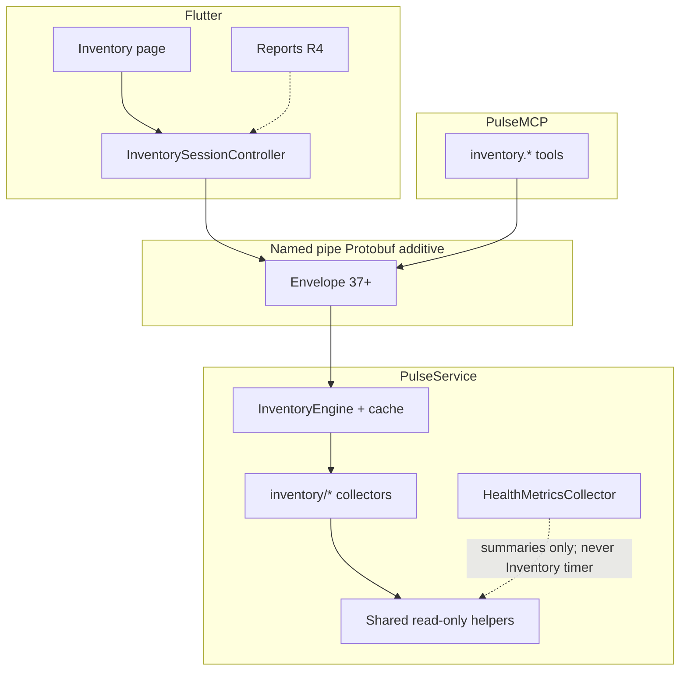

# R3 — Inventory Engine Architecture Plan

**Status:** **Approved** — [ADR-011](decisions/ADR-011-inventory-engine.md) **Accepted** (2026-08-02)  
**Roadmap:** [34-engineering-roadmap.md](34-engineering-roadmap.md) (R3)  
**Depends on:** R1 complete, R2 frozen, ADR-010  
**Constitution:** Observation only — official Windows APIs; no injection, hooks, registry writes, or invented rows.

Implementation may proceed under ADR-011. R3 is **complete** only when P0 + P1 + P2 meet ADR-011 § D11.

---

## Architectural review (locked decisions)

Verified against existing Pulse architecture (Health collectors, Envelope IPC, ADR-010 MCP):

| # | Requirement | Verdict | How |
|---|-------------|---------|-----|
| 1 | No duplicate collectors | **Pass** | Shared helpers OK; one enum path per domain; GPU PCIe helpers reused |
| 2 | Separate from Health collectors | **Pass** | `InventoryEngine` sibling path; Health cadence untouched |
| 3 | Snapshot-based, not high-freq polling | **Pass** | On-demand RPCs only for R3 exit |
| 4 | Cacheable + refreshable | **Pass** | Per-domain TTL + `force_refresh` + `generation` |
| 5 | IPC additive only | **Pass** | Envelope fields **37+**; hand-maintained codecs |
| 6 | MCP from day one | **Pass** | `inventory.*` schemas reserved; tools light up with collectors |
| 7 | UI independent of collectors | **Pass** | Flutter → IPC only |
| 8 | Graceful not-supported | **Pass** | Domain `status`: available / unsupported / access_denied / truncated / error |
| 9 | No startup delay | **Pass** | Lazy collect on first request |
| 10 | Incremental refresh when possible | **Pass** | Diff by stable id where cheap; software full-replace default |

Changes from the earlier draft plan embodied in ADR-011:

- Explicit **Health vs Inventory** boundary and **P0 / P1 / P2** domain phases.
- Broader domain catalog (displays, audio, Bluetooth, printers, battery, motherboard, BIOS, CPU, memory modules, storage, network adapters).
- Incremental `since_generation` protocol.
- MCP schema reservation before tool registration.
- Software hive limitation documented (machine-wide default).

---

## 1. Goal

Answer: “What is installed / connected on this Windows machine?” — read-only, local-first.

### P0 — Required (doc 34 exit)

| Category | Validation target |
|----------|-------------------|
| Services | `services.msc` / `Get-Service` |
| Drivers (ADR subset) | Device Manager / driverquery (subset honesty) |
| Installed software | Apps & Features (documented limits) |
| USB | Device Manager USB |
| PCI | Device Manager PCI |

### P1 — Optional same ADR (time-boxed)

Displays, Battery, Audio, Bluetooth, Printers.

### P2 — Static hardware lists (no Health-timer duplication)

Motherboard, BIOS, CPU (static), Memory modules (per-DIMM), Storage devices (all disks), Network adapters (all).

Process inventory and live metrics remain **Health-only**.

---

## 2. Architecture

### Principles

1. Collector-first; UI never invents rows.
2. Snapshot + TTL cache; no Inventory live push required for R3 exit.
3. Shared helpers, not forked collectors.
4. MCP-ready message shapes from the first wire commit.
5. PII: sensitive fields allowed on wire; not in unstructured logs.

### Non-goals

- Mutating services/drivers/software.
- WMI as primary source (unless future ADR).
- Full Driver Store / Store app parity.
- Folding catalogs into Health 1 Hz sampling.

---

## 3. Domain reference

Full API / permission / cost / refresh / cache / failure / MCP / report matrix: **[ADR-011 § Domain catalog](decisions/ADR-011-inventory-engine.md)**.

Summary:

| Domain | Phase | Primary APIs (see ADR) | Incremental |
|--------|-------|------------------------|-------------|
| Services | P0 | SCM `EnumServicesStatusExW` + query config | Yes (name) |
| Drivers | P0 | SCM `SERVICE_DRIVER` and/or SetupAPI subset | Yes |
| Software | P0 | Uninstall registry (read-only) | Full replace |
| USB | P0 | SetupAPI / CfgMgr | Yes (instance id) |
| PCI | P0 | SetupAPI (+ reuse GPU PCIe helpers) | Yes |
| Displays | P1 | SetupAPI / EnumDisplayDevices | Yes |
| Audio | P1 | SetupAPI | Yes |
| Bluetooth | P1 | SetupAPI | Yes |
| Printers | P1 | EnumPrinters or SetupAPI | Yes |
| Battery | P1 | Battery class + IOCTL | Full |
| Motherboard | P2 | SMBIOS RSMB Type 2 | Full |
| BIOS | P2 | SMBIOS Type 0 | Full |
| CPU | P2 | Shared CPUID / GLPIEx helpers | Full |
| Memory modules | P2 | SMBIOS Type 17 list | Full |
| Storage devices | P2 | Storage/SetupAPI disks | Prefer diff |
| Network adapters | P2 | IP Helper + SetupAPI | Prefer diff |

---

## 4. Collectors & engine

Path: `service/pulse_service/src/collectors/inventory/`

`InventoryEngine`:

- Owns per-domain cache (`generation`, TTL, rows).
- Runs collect off IPC hot path (worker).
- Applies caps + truncation flags.
- Returns domain status codes (ADR-011 D8).
- Supports `force_refresh` and `since_generation`.

Health collectors **unchanged** for R3 start.

---

## 5. IPC

Additive Envelope messages (field numbers **37+**). Per-domain RPCs preferred; optional aggregate snapshot over cache.

Wire codecs hand-maintained (`pulse.proto` + C++/Dart `pulse_wire`).

---

## 6. UI

- New **Inventory** shell destination.
- Tabs by domain (P0 first; P1/P2 as shipped).
- Virtualized lists; search client-side; refresh control; last-updated + generation.
- Status banners for unsupported / denied / truncated.

---

## 7. MCP & Reports

| Consumer | R3 | Later |
|----------|----|-------|
| PulseMCP | Schema + `available: false` until collector; then `inventory.*` tools | Resources on generation change |
| Reports | Optional JSON dump of snapshot | Service / Driver / Software + Hardware (USB/PCI) report templates consume Inventory Engine SSOT; System/P2 identity still Health until those collectors ship |

`service.status` catalog stub flips when `inventory.services` ships (ADR-010 follow-up).

---

## 8. Testing

Unchanged from prior plan: C++ unit/integration, wire goldens, Flutter controller/widget tests, spot-check archives vs OS tools, soak for handle leaks — **no invented rows**.

---

## 9. Performance

| Gate | Policy |
|------|--------|
| Service start | Zero Inventory collect |
| Idle | No Inventory timer |
| Open Inventory | Parallel per-visible-domain fetch; skeletons then fill |
| Caps | Software hard cap (e.g. 2000) documented |
| Timeouts | Per-domain hard cap; partial > hang |

---

## 10. Migration / work packages (after ADR Accepted)

| WP | Deliverable |
|----|-------------|
| A | ADR-011 → **Accepted**; this doc → **Approved**; doc 19 + 33 stubs |
| B | Proto + wire + engine cache skeleton (empty/`unsupported` OK) |
| C–G | P0 collectors + UI tabs + validation notes |
| H | P1 time-box or backlog links |
| I | P2 shared SMBIOS/adapter list helpers + UI |
| J | MCP tool registration as domains ship |
| K | Spot-check archive; check doc 34 boxes; freeze R3 |

---

## 11. Exit criteria

All doc 34 R3 **required** checkboxes evidenced. P1/P2 either shipped or explicitly backlogged with ADR-011 references. No R4 inventory templates claimed without data.

---

## Related

- [ADR-011](decisions/ADR-011-inventory-engine.md)
- [34 — Engineering roadmap](34-engineering-roadmap.md)
- [19 — Windows APIs](19-windows-apis.md)
- [33 — MCP bridge](33-mcp-bridge.md)
- [ADR-010](decisions/ADR-010-mcp-first-class-product.md)
- [AGENTS.md](../../AGENTS.md)
