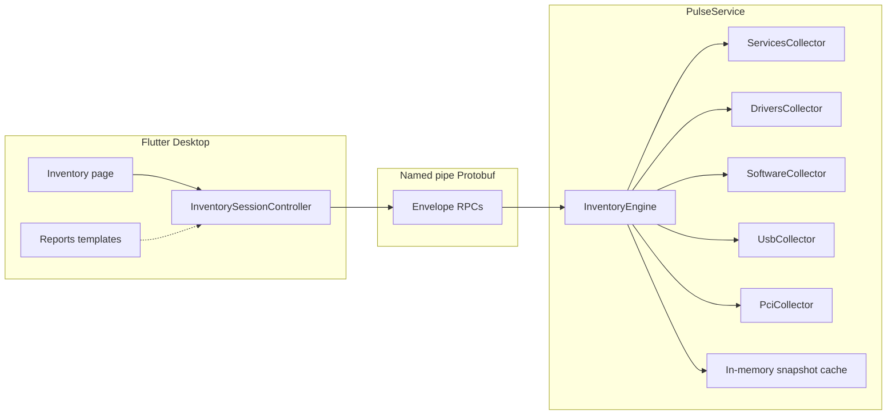

# R3 — Inventory Engine Implementation Plan (for approval)

**Status:** Draft — **awaiting maintainer approval**  
**Roadmap:** [34-engineering-roadmap.md](34-engineering-roadmap.md) (R3)  
**Prerequisite:** **ADR-011** must be accepted before any production code  
**Depends on:** R1 (complete), R2 (frozen 2026-08-02)  
**Constitution:** Observation only — official Windows APIs; no injection, hooks, registry writes, or invented rows.

This document is a planning artifact only. **No R3 implementation until this plan and ADR-011 are approved.**

---

## 1. Goal

Ship a first-class **Inventory** surface that answers: “What is installed / connected on this Windows machine?” — read-only, local-first, consistent with Timeline and System Health.

Required categories (doc 34 success metrics):

| Category | UI + IPC | Validation target |
|----------|----------|-------------------|
| Services | Yes | `services.msc` / `Get-Service` |
| Drivers | Yes (ADR-defined subset) | Device Manager / driverquery |
| Installed software | Yes (documented limits) | Apps & Features / Uninstall registry views |
| USB | Yes | Device Manager USB tree |
| PCI | Yes | Device Manager PCI / hardware IDs |

Optional if time-boxed in ADR-011: displays, battery — else explicit backlog linked to ADR-011.

---

## 2. Architecture



### Principles

1. **Collector-first** — UI never invents rows; empty/partial lists when APIs fail, with structured errors.
2. **Snapshot + optional refresh** — default: on-demand `Get*Inventory` RPCs; optional timed refresh only if ADR budgets allow (idle CPU near zero).
3. **Reuse patterns** from Health process inventory and Timeline: additive protobuf, Dart I/O isolate, virtualized lists, stable ids.
4. **PII / privacy** — ADR-011 must define which fields are sensitive (user SIDs on services, install paths, publisher); never log secrets; Settings disclosure if MCP later exposes inventory.
5. **MCP-ready schemas** — message shapes usable later by PulseMCP (`inventory.services`, etc.) without redesign (align with doc 33).

### Non-goals (R3)

- Changing services/drivers (start/stop/install) — observation only.
- ETW/WMI as primary inventory sources (may be future).
- Full Software Center / Store catalog parity.
- Replacing Device Manager UX complexity in v1 Inventory.

---

## 3. ADR-011 (blocking)

ADR-011 must lock before code:

| Topic | Decisions needed |
|-------|------------------|
| APIs | Exact Win32 / SetupAPI / registry **read** surfaces per category + Microsoft Learn links |
| Scope | Installed vs running services; kernel vs user drivers; 32/64-bit uninstall keys |
| PII | Field allowlist; redaction rules for logs/exports |
| Refresh | Manual only vs interval; cache TTL; cancelation |
| IPC | Message names, pagination, filtering, error codes |
| Privileges | What works as standard user vs admin; never auto-elevate |
| Limits | Max row counts, truncation policy, `available: false` semantics |
| Validation | Spot-check procedure vs OS tools |

**Deliverable before coding:** `docs/architecture/decisions/ADR-011-inventory-engine.md` accepted.

---

## 4. Collectors (service)

Proposed modules under `service/pulse_service/src/collectors/inventory/`:

| Collector | Responsibility | Suggested official APIs (to confirm in ADR-011) |
|-----------|----------------|--------------------------------------------------|
| `services_collector` | Enumerate Windows services | `OpenSCManager` + `EnumServicesStatusExW` / `QueryServiceConfigW` / `QueryServiceConfig2W` (SERVICE_CONFIG_DESCRIPTION) — **read** access only |
| `drivers_collector` | Driver / device driver subset | Prefer SetupAPI device enumeration filtered by class, and/or `EnumDeviceDrivers` + file version info for image path; **document subset** (e.g. signed kernel drivers present in system) |
| `software_collector` | Installed applications | Read-only uninstall registry views: `HKLM\SOFTWARE\Microsoft\Windows\CurrentVersion\Uninstall`, WOW6432Node, and per-user `HKCU\…\Uninstall` when readable; never write |
| `usb_collector` | USB devices | SetupAPI with USB device classes / `CM_Get_Device_ID` style paths via CfgMgr32 as documented |
| `pci_collector` | PCI devices | SetupAPI + PCI properties (existing GPU path already uses SetupAPI/`DEVPKEY_PciDevice_*` in `gpu_adapter_info.cpp` — reuse helpers) |

### Engine

`InventoryEngine` (or facade on `ServiceCore`):

- Runs collectors off the UI/IPC hot path (worker thread / existing collector pool).
- Aggregates into typed snapshot structs.
- Applies ADR caps (e.g. max N software rows) with honest truncation flags.
- Never invents missing DisplayName / hardware IDs — empty string or omit optional fields.

### Existing code to reuse

- SCM open patterns: `service_identity.cpp`, `service_core.cpp` (PulseService only today).
- SetupAPI / PCI property reads: `gpu_adapter_info.cpp`.
- Process inventory upsert model: `HealthProcessInventoryUpdate` (pattern for incremental updates if ADR allows).

---

## 5. Windows APIs (doc 19 updates)

After ADR-011, extend [19-windows-apis.md](19-windows-apis.md) with an **Inventory** section listing only linked APIs. Candidates (non-normative until ADR):

- Advapi32 / winsvc: `OpenSCManagerW`, `EnumServicesStatusExW`, `OpenServiceW`, `QueryServiceConfigW`, `QueryServiceConfig2W`, `CloseServiceHandle`
- SetupAPI: `SetupDiGetClassDevsW`, `SetupDiEnumDeviceInfo`, `SetupDiGetDeviceRegistryPropertyW`, `SetupDiGetDevicePropertyW`, `SetupDiDestroyDeviceInfoList`
- CfgMgr32 (if ADR chooses): device ID / status queries
- Version.dll (optional): `GetFileVersionInfo` for driver/software file metadata
- Registry: `RegOpenKeyExW` / `RegEnumKeyExW` / `RegQueryValueExW` **read-only**

Explicitly forbidden (AGENTS.md): registry writes, service control start/stop from Inventory UI, undocumented Nt* enumeration as primary path.

---

## 6. IPC additions

### Wire style

Follow Timeline R2: **additive** `pulse.proto` fields; regenerate C++ `pulse_wire` + Dart `pulse_wire`; extend DecodeEnvelope allowlist; never break old clients.

### Proposed RPC sketch (finalize in ADR-011)

```text
GetServicesInventory { } → ServicesInventory { repeated ServiceEntry; bool truncated; string error }
GetDriversInventory { } → DriversInventory { … }
GetSoftwareInventory { } → SoftwareInventory { … }
GetUsbInventory { } → UsbInventory { … }
GetPciInventory { } → PciInventory { … }
GetInventorySnapshot { } → InventorySnapshot { all sections + generated_at }
```

Optional later: `StartInventoryMonitoring` / push diffs — **not required** for R3 exit if manual refresh meets metrics.

### Entry fields (illustrative)

| Domain | Stable id | Core fields |
|--------|-----------|-------------|
| Service | service name | display_name, state, start_type, account, binary_path (if allowed), description |
| Driver | module / device instance id | name, version, publisher, path, class |
| Software | uninstall key GUID/name | display_name, version, publisher, install_date, install_location |
| USB | instance id | description, manufacturer, hardware_ids, hub/port if available |
| PCI | instance id | description, vendor/device ids, location string |

All timestamps UTC ISO / unix ms consistent with Health/Timeline.

### Envelope field numbers

Allocate next free `oneof` ids after Timeline detail (35/36) — exact numbers in ADR + proto comment block.

---

## 7. UI integration

### Navigation

- New sidebar destination **Inventory** (between Health and Reports, or as ADR prefers).
- Command palette entry + keyboard shortcut slot if available.

### Page structure (Windows 11 / VS-inspired)

- Category tabs or segmented control: Services | Drivers | Software | USB | PCI
- Each tab: search field, virtualized `SliverList` / `ListView.builder`, details side panel (wide) / bottom sheet (narrow)
- Empty / error / truncated banners that **explain** (constitution)
- Refresh button; last-updated timestamp
- Export: reuse Reports generators once R4 deepens — R3 minimum is on-screen + optional JSON dump of current snapshot

### Controllers

- `InventorySessionController` mirroring `TimelineSessionController` / Health: load snapshot, apply search filter client-side, cancel in-flight requests on dispose.
- No fabricated placeholders pretending to be devices.

### Reports / MCP

- R4 will add inventory-backed report templates — R3 exposes data only.
- Schemas documented so R5/R6 can add `inventory.*` tools without reshaping IPC.

---

## 8. Testing strategy

| Layer | Tests |
|-------|--------|
| C++ unit | Collectors against fixtures / mocked handles where feasible; empty-machine / access-denied paths |
| C++ integration | Live EnumServices / SetupAPI on CI agent (skip or soft-fail if privileges insufficient) |
| Wire | Encode/decode golden for each inventory message |
| Flutter unit | Query/filter helpers; controller load/error/truncation |
| Flutter widget | Virtualized list smoke; details panel field rendering |
| Manual validation | Spot-check matrix vs `services.msc`, Device Manager, Apps & Features — archive like R2 |
| Soak | Inventory refresh must not leak handles or grow RSS unbounded |

Success metrics from doc 34 must each have recorded evidence before R3 close.

---

## 9. Performance considerations

| Concern | Approach |
|---------|----------|
| Startup | Do **not** collect full inventory on service start; on-demand when UI opens Inventory |
| Idle CPU | No polling unless ADR enables; default manual refresh |
| Large software lists | Cap + `truncated`; virtualize UI; avoid loading icons synchronously for thousands of rows |
| SetupAPI cost | Cache snapshot with TTL; refresh replaces atomically |
| IPC payload | Paginate or sectioned RPCs; avoid mega-`GetInventorySnapshot` if > budget (measure; ADR may prefer per-category) |
| RAM | Document peak RSS with full software+drivers on a busy machine |

Target alignment with AGENTS.md: idle near-zero CPU; Inventory open should remain responsive (first paint with skeletons, then fill).

---

## 10. Migration strategy

1. **Docs first:** ADR-011 → this plan approval → update doc 19 + architecture README.
2. **Wire first:** additive proto + wire regen + empty handlers returning `available: false` / empty lists (optional scaffolding commit).
3. **Collectors phased:** Services → Drivers → Software → USB → PCI (each with tests + UI tab).
4. **UI:** page shell early with “not yet available” honesty for unfinished tabs.
5. **Validation archive** per category; then check doc 34 boxes.
6. **Freeze R3** only when all required metrics pass; optional displays/battery as ADR backlog.

No breaking IPC; old Flutter clients ignore unknown envelope fields.

---

## 11. Work packages (proposed commit order after approval)

| WP | Deliverable |
|----|-------------|
| A | ADR-011 accepted + plan status → Approved |
| B | Proto + wire + IPC stubs |
| C | Services collector + UI tab + validation notes |
| D | Drivers collector + UI |
| E | Software collector + UI + limits docs |
| F | USB + PCI collectors + UI |
| G | Cross-cutting search, details, export JSON, MCP schema notes |
| H | Spot-check archive + doc 34 close |

---

## 12. Risks

| Risk | Mitigation |
|------|------------|
| Privilege gaps | Document per-field; never fake admin-only data |
| Uninstall registry inconsistency | Document known Store/UWP gaps; no invented apps |
| Driver definition ambiguity | ADR-defined subset only |
| Handle leaks in SetupAPI | RAII wrappers + soak tests |
| Scope creep (full Device Manager) | Strict success metrics; optional backlog |

---

## 13. Exit criteria

All doc 34 R3 checkboxes checked with evidence. ADR-011 + doc 19 updated. No R4 inventory templates claimed until data exists.

---

## Related

- [34 — Engineering roadmap](34-engineering-roadmap.md)
- [19 — Windows APIs](19-windows-apis.md)
- [05 — IPC](05-ipc.md)
- [33 — MCP bridge](33-mcp-bridge.md)
- [AGENTS.md](../../AGENTS.md)
- R2 freeze: [archives/r2-validation-report-2026-08-02.md](archives/r2-validation-report-2026-08-02.md)
