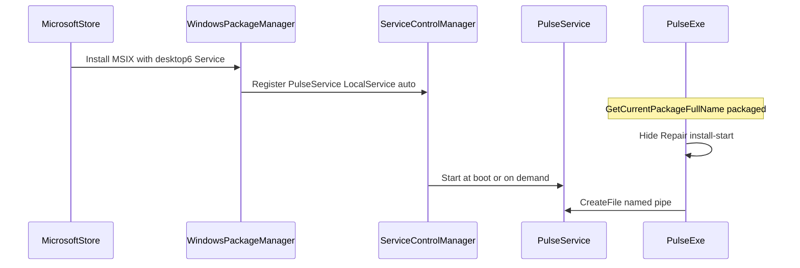
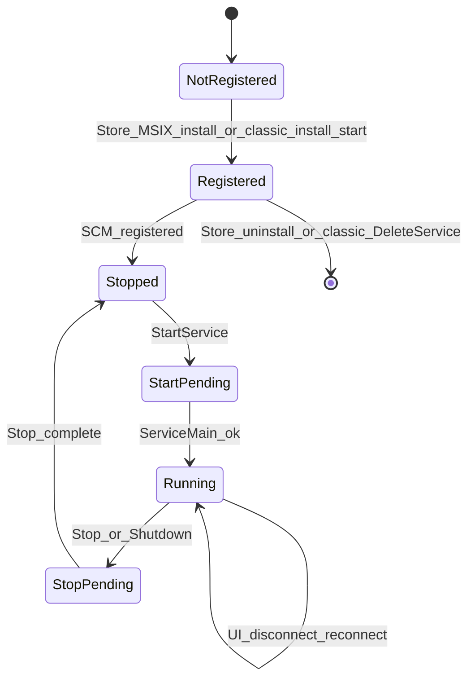
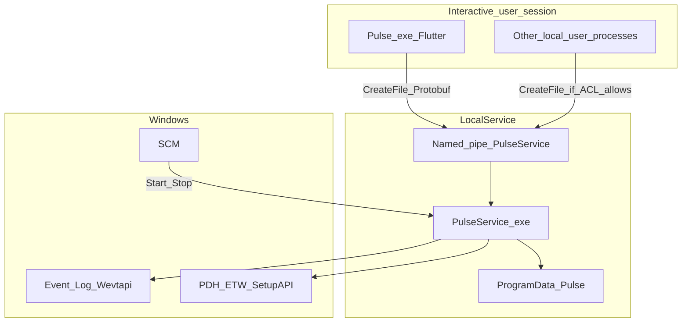
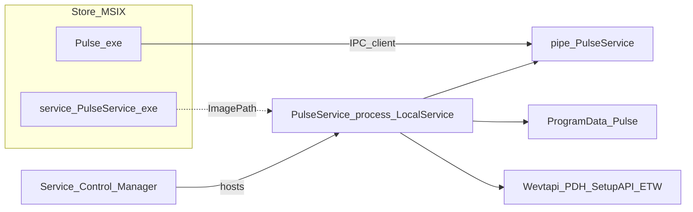
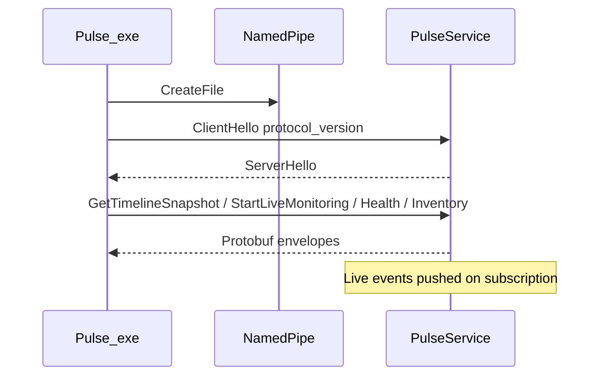
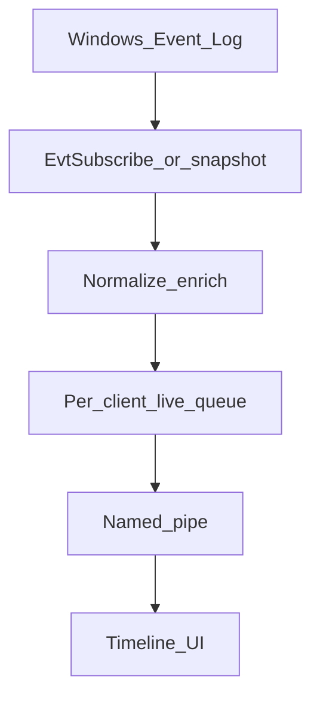
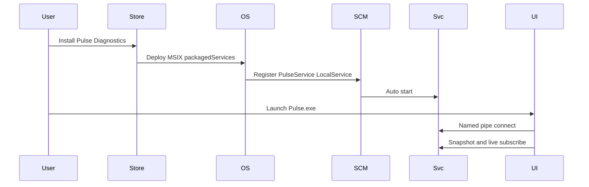

# Pulse Diagnostics — Business Justification for `packagedServices`

**Audience:** Microsoft Store / Partner Center certification (restricted capability review)  
**Product:** Pulse Diagnostics (`Regncreative.PulseDiagnostics`, Store ID `9PNDTLNTJ82T`)  
**Capability requested:** `packagedServices` only  
**Capability not requested:** `localSystemServices`  
**Service account:** Local Service (`desktop6:Service` `StartAccount="localService"`)  
**Package service binary:** `service\PulseService.exe`  
**Document type:** Engineering whitepaper grounded in the shipping codebase  
**Branch context:** Store packaged-service work (`store/packaged-service`)

---

## How to read this document

Every behavioral claim below is tied to an implementation artifact (source file, ADR, or packaging script). Where the repository documents a behavior that the current code does **not** implement, this paper states that explicitly. We do not invent recovery policies, authentication schemes, or network behavior.

Product constitution: [AGENTS.md](../../AGENTS.md) — observation only; never inject, patch, hook, or bypass Windows security; local-first; no telemetry.

---

# Executive Summary

**Pulse** (product display name **Pulse Diagnostics** on the Microsoft Store) is a professional **read-only Windows observability** application. It helps users understand what Windows is doing by presenting Event Log activity, system health metrics, hardware/inventory catalogs, and diagnostics status in a modern desktop UI.

Pulse is split into two processes:

| Process | Role | Technology |
|---------|------|------------|
| `Pulse.exe` | Presentation client | Flutter Desktop |
| `PulseService.exe` | Continuous observation host | C++20 Windows Service |

This split is normative architecture ([AGENTS.md](../../AGENTS.md), [ADR-002](../architecture/decisions/ADR-002-windows-service.md), [01-system-overview.md](../architecture/01-system-overview.md)). The Flutter application **does not call Windows diagnostic APIs** for Event Log / health / inventory collection. Those responsibilities run inside `PulseService`. The UI connects over a **local named pipe** (`\\.\pipe\PulseService`) using length-prefixed Protobuf frames ([ADR-003](../architecture/decisions/ADR-003-named-pipe-ipc.md), [05-ipc.md](../architecture/05-ipc.md)).

### Why a background Windows service exists

Observation must continue:

1. **When the UI is closed** — AGENTS.md and ADR-002 require continuous collection independent of the Flutter process lifecycle.
2. **Across interactive session boundaries** — a tray/user process dies on logoff; a Local Service does not.
3. **With a stable, least-privilege account** — collectors need a durable identity (`NT AUTHORITY\LocalService`) rather than elevating the interactive user for every observation API.
4. **With SCM-managed lifetime** — install once, auto-start at boot, accept STOP/SHUTDOWN, remain available for the UI to reconnect ([`service_core.cpp`](../../service/pulse_service/src/service_core/service_core.cpp)).

### Why `packagedServices` is required for the Store edition

The Microsoft Store MSIX embeds `service\PulseService.exe` and declares:

```xml
<desktop6:Extension Category="windows.service"
    Executable="service\PulseService.exe"
    EntryPoint="Windows.FullTrustApplication">
  <desktop6:Service Name="PulseService"
      StartupType="auto"
      StartAccount="localService" />
</desktop6:Extension>
```

([`package_msix_store.ps1`](../../tools/scripts/package_msix_store.ps1), [`validate_msix_store.ps1`](../../tools/scripts/validate_msix_store.ps1), [`microsoft-store.md`](../guides/microsoft-store.md)).

Without `packagedServices`, Windows cannot register this Local Service from the AppxManifest. The Store UI alone cannot perform observation; certification previously failed with an unusable feature when the package shipped UI-only. The Store path **must not** call classic `CreateService` / `--install-start` ([`IsRunningAsPackagedApp`](../../service/pulse_service/src/service_core/service_core.cpp), Flutter [`ServiceLifecycleController`](../../apps/pulse_app/lib/application/service_lifecycle_controller.dart)). Package registration is therefore the only Store-compatible install mechanism.

We request **`packagedServices` only**. We do **not** request `localSystemServices`. The service runs as **Local Service**, matching classic Inno installs that already use `NT AUTHORITY\LocalService` in `CreateServiceW` ([`service_core.cpp`](../../service/pulse_service/src/service_core/service_core.cpp)).

---

# Why StartupTask, runFullTrust-only execution, Scheduled Tasks, or a user-mode background process are insufficient

ADR-002 already rejected several of these alternatives. The following maps each option to **Pulse’s actual implementation constraints**.

## 1. Flutter `runFullTrust` process only (no Windows service)

**What we already have:** The Store package declares `runFullTrust` for `Pulse.exe` ([`pubspec.yaml` `msix_config`](../../apps/pulse_app/pubspec.yaml)).

**Why it is insufficient alone:**

| Requirement | Why UI-only fails |
|-------------|-------------------|
| Survive UI close | Closing Pulse.exe ends the Flutter process; collectors would stop. |
| Survive logoff | Interactive full-trust apps do not replace Local Service session lifetime. |
| Centralize privileges | Architecture forbids calling Event Log / PDH / SetupAPI collectors from the UI ([01-system-overview.md](../architecture/01-system-overview.md)). |
| Named-pipe server durability | `IpcServer` lives in the service ([`ipc_server.cpp`](../../service/pulse_service/src/ipc/ipc_server.cpp)); the UI is a `CreateFile` client ([`pulse_ipc_client.dart`](../../apps/pulse_app/lib/ipc/pulse_ipc_client.dart)). |

`runFullTrust` remains necessary for the desktop bridge UI; it does **not** substitute for `packagedServices`.

## 2. Desktop `StartupTask` (auto-start UI or helper at user logon)

**Insufficient because:**

- Starts in the **user session**, not as Local Service.
- Does not provide SCM auto-start at boot independent of interactive logon.
- Does not match the implemented process model (`PulseService` + `StartServiceCtrlDispatcherW` / `ServiceMain` in [`service_core.cpp`](../../service/pulse_service/src/service_core/service_core.cpp)).
- Would still require a long-running collector host; StartupTask only schedules launch, it does not define the service security context Pulse uses today.

## 3. Scheduled Task

ADR-002: “No real-time lifecycle; no recovery; awkward for continuous observation.”

**Additionally for Pulse:**

- Health push and live Event Log subscription are **continuous** (`IpcServer` accept loop + health push thread + `EvtSubscribe` path in [`ipc_server.cpp`](../../service/pulse_service/src/ipc/ipc_server.cpp)), not periodic batch jobs.
- Task Scheduler does not provide the same STOP/SHUTDOWN control channel Pulse implements via SCM (`SERVICE_ACCEPT_STOP | SERVICE_ACCEPT_SHUTDOWN`).
- A task running as the interactive user cannot reuse the LocalService pipe ownership / SDDL model already coded (`kPipeSddl` grants `LS` GA — [`constants.hpp`](../../shared/pulse_common/include/pulse/constants.hpp)).

## 4. User-mode tray / background Flutter isolate without SCM

ADR-002: “Dies on logoff; no SCM recovery; cannot run as LocalService.”

The Flutter app already uses an **I/O isolate** for pipe I/O ([`pulse_ipc_client.dart`](../../apps/pulse_app/lib/ipc/pulse_ipc_client.dart)); that isolate is still part of the UI process tree and stops when the app exits. It cannot host Wevtapi subscriptions and PDH sampling for other users or after the UI is gone.

## 5. Classic `CreateService` from the Store app (elevated `--install-start`)

This is how **GitHub/Inno** installs work ([`Pulse.iss`](../../tools/installer/Pulse.iss), [`InstallService`](../../service/pulse_service/src/service_core/service_core.cpp)).

It is **intentionally disabled** for MSIX:

- Native: `GetCurrentPackageFullName` → refuse `--install` / `--uninstall` (exit code 3).
- Flutter Store path: hide Repair/Install; never call `--install-start`.

Store certification requires package-owned registration, not runtime SCM self-installation fighting the package lifecycle.

### Comparison summary

| Option | Boot/auto start | Survives UI exit | LocalService | Matches code today |
|--------|-----------------|------------------|--------------|--------------------|
| Packaged Win32 service (`packagedServices`) | Yes (`StartupType=auto`) | Yes | Yes | **Yes (Store)** |
| Classic SCM `--install-start` | Yes | Yes | Yes | **Yes (GitHub only)** |
| `runFullTrust` UI only | No | No | No | Partial (UI only) |
| StartupTask | User logon | No (if task is UI) | No | Not implemented |
| Scheduled Task | Possible | Weak | Wrong model | Not implemented |
| Tray / background UI | No | No | No | Rejected by ADR-002 |

---

# PulseService responsibilities

## Mandatory for product observation (implemented in service)

These are hosted in `PulseService.exe` and exposed to the UI over IPC:

1. **Named-pipe IPC server** — accept clients, frame protobuf envelopes, dispatch requests ([`ipc_server.cpp`](../../service/pulse_service/src/ipc/ipc_server.cpp)).
2. **Timeline / Event Log observation** — snapshot and live subscription via Wevtapi against the diagnostics channel catalog ([`event_log_channels.cpp`](../../service/pulse_service/src/collectors/event_log_channels.cpp), live path in `ipc_server.cpp`). Channels include System (required), Application/Setup/optional operational logs, and Security as **probe-open** (often denied under LocalService).
3. **System Health sampling** — PDH counters, memory/CPU, disk volume capacity, adapter rates, process inventory metrics, optional network ETW session for per-process rates ([`health_metrics_collector.cpp`](../../service/pulse_service/src/collectors/health_metrics_collector.cpp), [`network_etw_engine.cpp`](../../service/pulse_service/src/collectors/network_etw_engine.cpp)).
4. **Inventory domains** — read-only catalogs (services, drivers, software from HKLM Uninstall, USB/PCI, displays, audio, Bluetooth, battery, printers, SMBIOS-derived motherboard/BIOS/memory, CPU, storage, network adapters) under [`service/pulse_service/src/inventory/`](../../service/pulse_service/src/inventory/).
5. **Diagnostics identity / status** — service version, paths, SCM state queries for PulseService itself ([`diagnostics/`](../../service/pulse_service/src/diagnostics/)).
6. **Local logging** — JSONL under `%ProgramData%\Pulse\logs\` ([`logger.cpp`](../../service/pulse_service/src/logging/logger.cpp)).
7. **Local configuration bootstrap** — `%ProgramData%\Pulse\config.json` ([`config.cpp`](../../service/pulse_service/src/util/config.cpp)).

## Optional / conditional

| Responsibility | Behavior |
|----------------|----------|
| Security Event Log | Attempt `EvtOpenLog`; on ACL failure, skip and warn — expected under LocalService ([`event_log_channels.cpp`](../../service/pulse_service/src/collectors/event_log_channels.cpp), [21-event-viewer-integration.md](../architecture/21-event-viewer-integration.md)). |
| Network ETW health session | Used for per-process network rates when health monitoring is active; local kernel providers only — not a remote telemetry channel. |
| Synthetic diagnostics test event | IPC `InjectDiagnosticsTestEvent` inserts a **synthetic timeline event** for developer testing — not OS code injection ([`ipc_server.cpp`](../../service/pulse_service/src/ipc/ipc_server.cpp)). |

## Explicit non-responsibilities (not in service)

- Flutter UI rendering, settings UX, report export file dialogs (UI process).
- PulseMCP AI bridge (`PulseMCP.exe`) — separate optional process in the **GitHub** payload; **not** embedded by `package_msix_store.ps1` / Store validator today.
- Classic SCM `CreateService` when running with package identity.

## Why these belong in the service instead of the UI

1. **Architecture law** — Flutter must not call Windows diagnostic APIs for collection ([01-system-overview.md](../architecture/01-system-overview.md)).
2. **Lifetime continuity** — subscriptions and PDH queries outlive UI navigation and process exit.
3. **Single writer of ProgramData logs/config** — service owns `%ProgramData%\Pulse\`.
4. **Account model** — LocalService is a service SID, not the interactive user’s token.

### Implementation note (Collector placeholder)

`Collector::Start()` currently logs that it is a **placeholder** and does not open Event Log itself ([`collector.cpp`](../../service/pulse_service/src/collector/collector.cpp)). Production Event Log access is implemented on the **IPC-driven** paths (`EnsureLiveSubscriber`, snapshot collection inside `IpcServer`). Health is started from `IpcServer::EnsureHealthCollector()`. This paper describes the **actual** collection entry points, not the unused placeholder class name.

---

# Service lifecycle

## Installation

### GitHub / Inno (classic — unchanged)

1. Setup copies `service\PulseService.exe` under Program Files.
2. Elevated `PulseService.exe --install-start` → `CreateServiceW` / `ChangeServiceConfigW` with `NT AUTHORITY\LocalService`, `SERVICE_AUTO_START` ([`Pulse.iss`](../../tools/installer/Pulse.iss), [`InstallService`](../../service/pulse_service/src/service_core/service_core.cpp)).
3. `StartServiceW` and wait until `SERVICE_RUNNING`.

### Microsoft Store (packaged)

1. User installs MSIX from Store (admin required for packages that include services — OS behavior).
2. Windows registers `desktop6:Service` Name=`PulseService`, `StartupType=auto`, `StartAccount=localService`.
3. Binary path is package-relative `service\PulseService.exe`.
4. App and service **must not** call `CreateService` / `--install-start` when packaged.



## Startup (SCM)

1. SCM launches `PulseService.exe` without CLI flags → `RunServiceMode` → `StartServiceCtrlDispatcherW`.
2. `ServiceMain`: `BootstrapFromDisk` loads/creates `%ProgramData%\Pulse\config.json`.
3. `ServiceCore::Initialize` constructs `IpcServer` (+ placeholder Collector).
4. `ServiceCore::Start` starts IPC accept loop (and health collector via IPC server).
5. Status → `SERVICE_RUNNING`.
6. Event Log live subscription starts when a client sends `StartLiveMonitoring` (lazy).

## Shutdown / stop

- SCM `SERVICE_CONTROL_STOP` / `SHUTDOWN` → `ServiceCore::Stop` stops IPC and collector placeholder.
- CLI `--stop` opens SCM and stops with wait ([`StopInstalledService`](../../service/pulse_service/src/service_core/service_core.cpp)).
- Flutter Store/classic: elevated `--stop` via UAC (`ShellExecuteEx` runas) ([`pulse_service_launcher.dart`](../../apps/pulse_app/lib/platform/pulse_service_launcher.dart)).

## Restart

- CLI `--restart` = stop then start.
- Flutter Restart control uses the same elevated CLI.

## Failure recovery

**Verified in code:**

- Service reports STOP/SHUTDOWN acceptance to SCM.
- UI reconnects to the pipe on failure with a retry delay ([`pulse_ipc_client.dart`](../../apps/pulse_app/lib/ipc/pulse_ipc_client.dart)).

**Not verified in `CreateService` implementation:**

- Architecture doc [`04-native-service.md`](../architecture/04-native-service.md) mentions SCM failure actions (restart delays). The current `CreateServiceW` / `ChangeServiceConfigW` path does **not** call `ChangeServiceConfig2` for failure actions. Packaged-service failure actions, if any, would be whatever Windows applies by default for `desktop6:Service` — **not customized in our AppxManifest today**. We do not claim custom crash-restart timers for the Store package.

## UI disconnect

- Closing `Pulse.exe` does **not** stop `PulseService`.
- Pipe instances close; service accept loop continues.
- Reopening UI runs `ipc.start()` → `CreateFile` → `ClientHello` again ([`app_services.dart`](../../apps/pulse_app/lib/di/app_services.dart), [`timeline_session_controller.dart`](../../apps/pulse_app/lib/application/timeline_session_controller.dart)).

## Windows reboot

- `StartupType=auto` / `SERVICE_AUTO_START` → service intended to return after reboot.
- UI starts later and reconnects over the pipe.
- `%ProgramData%\Pulse\` persists across reboot and across Store updates ([41-store-packaged-service.md](../architecture/41-store-packaged-service.md)).



---

# IPC architecture

## Transport

- **Name:** `\\.\pipe\PulseService` ([`constants.hpp`](../../shared/pulse_common/include/pulse/constants.hpp), Dart `kPipeName`).
- **Mode:** duplex, byte stream, overlapped server instances.
- **Max instances:** default 32 (config clamp 2–64) to allow UI + tools headroom.

## Framing and schema

- Magic `PULS` + little-endian `uint32` length + protobuf payload.
- Max payload 2 MiB.
- Schema: [`shared/pulse_protocol/proto/pulse.proto`](../../shared/pulse_protocol/proto/pulse.proto); codecs in C++/Dart wire libraries.
- Protocol version constant `1`; mismatched `ClientHello.protocol_version` → error response ([`ipc_server.cpp`](../../service/pulse_service/src/ipc/ipc_server.cpp)).

## Authentication and ACLs

**Pipe SDDL** ([`constants.hpp`](../../shared/pulse_common/include/pulse/constants.hpp)):

```text
D:(A;;GA;;;SY)(A;;GA;;;LS)(A;;GRGW;;;BA)(A;;GRGW;;;BU)
```

| ACE | Meaning |
|-----|---------|
| SY | Local System — full |
| LS | Local Service — full (service owns the pipe) |
| BA | Built-in Administrators — read/write |
| BU | Built-in Users — read/write |

Applied via `ConvertStringSecurityDescriptorToSecurityDescriptorA` + `CreateNamedPipeW` ([`ipc_server.cpp`](../../service/pulse_service/src/ipc/ipc_server.cpp)).

**Client “authentication” as implemented:**

- Successful `CreateFile` against the ACL.
- Optional `ClientHello` carrying protocol version, client name, and client version — **name/version are logged, not allowlisted**.
- **Not implemented:** named-pipe impersonation, client process ID allowlists, mutual TLS, or capability tokens.

### Honest statement on “arbitrary processes cannot control the service”

- **SCM install/uninstall:** protected by admin / package identity gates; Store builds refuse self-`CreateService`.
- **IPC surface:** any local process running as a user that passes the pipe ACL **can open the pipe** and send protobuf requests that the server understands (timeline, health, inventory, diagnostics). Control is limited to **those diagnostics RPCs**, not arbitrary OS administration. There is **no** evidence of command execution RPCs.

This is a **local same-machine diagnostics bus**, not a remote management API.

## Allowed clients (by design)

| Client | Present in Store MSIX? | Role |
|--------|------------------------|------|
| `Pulse.exe` Flutter UI | Yes | Primary observer UI |
| `PulseMCP.exe` | **No** (GitHub package only today) | Optional AI MCP bridge over same pipe |
| Dev tools (`pulse_ipc_ping`, etc.) | Repo tools | Engineering |

---

# Security model

## ProgramData usage

Resolved with `SHGetKnownFolderPath(FOLDERID_ProgramData)` → `%ProgramData%\Pulse\` ([`config.cpp`](../../service/pulse_service/src/util/config.cpp)):

| Path | Purpose |
|------|---------|
| `%ProgramData%\Pulse\config.json` | IPC/logging defaults |
| `%ProgramData%\Pulse\logs\pulse-service-YYYY-MM-DD.jsonl` | Structured service logs |
| `%ProgramData%\Pulse\data\` | Data directory created for local persistence layout |

**No writes into the MSIX install directory** were found in the service. Packaged execution does not depend on a writable package root.

## Configuration storage

Default `config.json` written only if missing — Event Log source flag forced off in loader historically (`TASK-001`); pipe name/instances/logging level are the principal persisted IPC settings ([`config.cpp`](../../service/pulse_service/src/util/config.cpp)).

## Logs

Local JSONL only; also mirrored to stderr in console scenarios ([`logger.cpp`](../../service/pulse_service/src/logging/logger.cpp)). No upload path found in service sources.

## Permissions / least privilege

- Service account: **Local Service** (classic `CreateService` and Store `StartAccount=localService`).
- No evidence of enabling additional privileges such as `SeDebugPrivilege` or `SeSecurityPrivilege` in service code.
- Security log often **denied** — product treats this as expected, not a reason to elevate to Local System ([21-event-viewer-integration.md](../architecture/21-event-viewer-integration.md)).

## No admin after installation (observation path)

- Day-to-day Event Log/health/inventory observation runs as LocalService without UAC.
- **Admin elevation remains** for interactive Start/Stop/Restart via `ShellExecuteEx` `runas` when the user clicks those controls — explicit user action ([AGENTS.md](../../AGENTS.md) elevation rule; [`pulse_service_launcher.dart`](../../apps/pulse_app/lib/platform/pulse_service_launcher.dart)).
- Store Repair/Install elevation path is removed; package registration replaces it.

## LocalService isolation / why not LocalSystem

See next section. ADR-002 selects LocalService for minimal privilege footprint.

---

# Why LocalService is required

Pulse’s collectors need a **non-interactive, machine-local, least-privilege service identity** that:

1. Owns the named pipe as `LS` in the SDDL.
2. Survives user logoff.
3. Can open Event Log channels Windows grants to LocalService (System/Application/etc.).
4. Matches the account already used in production classic installs — Store must not silently widen to Local System.

## Versus LocalSystem

| Topic | LocalService (implemented) | LocalSystem (rejected) |
|-------|----------------------------|-------------------------|
| Privilege | Least service class | Highest machine privilege |
| Store capability | `packagedServices` | Would require `localSystemServices` |
| Security Event Log | Often denied — accepted | Not used as justification to elevate |
| AGENTS.md | Prefer minimal privilege | Conflicts with least privilege |

We **do not** request `localSystemServices`.

## Versus NetworkService

NetworkService is oriented toward network-facing service identity. PulseService is **local observation + local pipe**. No service outbound cloud client was found. NetworkService would not match the pipe SDDL/`LS` ACE model already coded.

## Versus interactive user

- Dies with logoff / UI exit.
- Would require the user’s token for continuous collection — wrong trust boundary.
- Cannot implement ADR-002 service model.

## Versus Scheduled Task / StartupTask / runFullTrust-only

Covered above: none provide LocalService + SCM continuous lifecycle as implemented.

---

# Least Privilege

## How privileges are minimized

1. Account = LocalService (not LocalSystem).
2. Observation APIs are read-oriented (Event Log query/subscribe, PDH, SetupAPI queries, registry **read** of HKLM Uninstall, SMBIOS read, etc.).
3. **No** `RegSet*` / `RegCreate*` / `RegDelete*` usage found under `service/pulse_service/src`.
4. **No** `CreateProcess` / `ShellExecute` / `WinExec` found under `service/pulse_service`.
5. **No** process-injection APIs (`VirtualAllocEx`, `WriteProcessMemory`, `CreateRemoteThread`) found.
6. Plugin runtime deferred / absent ([ADR-006](../architecture/decisions/ADR-006-plugin-deferral.md); no plugin symbols in service `src`).
7. Store package refuses SCM self-install when packaged.

## Representative APIs actually used (non-exhaustive, from code)

- Wevtapi: Event Log open/subscribe/query  
- PDH: performance counters  
- SetupAPI / Configuration Manager: device inventories  
- SCM: enumerate/query services & drivers; control **PulseService** only from elevated CLI helpers  
- Win32 network information: `GetAdaptersAddresses`, `GetIfTable2`, WLAN query  
- ETW consume (health): Kernel-Network / TCPIP providers via `StartTraceW` / `EnableTraceEx2` in-process session name `PulseHealthNet`  
- Process metrics: `OpenProcess(PROCESS_QUERY_LIMITED_INFORMATION)`, `QueryFullProcessImageNameW`, `NtQueryInformationProcess` (command line info class)  
- `GetModuleHandle` + `GetProcAddress` on **already loaded** `ntdll`/`kernel32` — not a plugin loader  

## What the service cannot do (as implemented)

- Execute arbitrary commands or scripts  
- Download or host plugins  
- Load third-party plugin DLLs (`LoadLibrary` not used for plugins; only `GetProcAddress` on system modules already loaded)  
- Expose a remote HTTP/TCP management API  
- Perform OS code injection  
- Bypass Windows security (AGENTS.md)  

---

# Functionality limits

The following statements are **true for the current `service/pulse_service` tree** unless a nuance is noted.

| Statement | Status |
|-----------|--------|
| Cannot execute arbitrary commands | **True** — no process spawn APIs found |
| Cannot download plugins | **True** — no plugin host; no HTTP client download path found |
| Cannot load plugin DLLs | **True** — no plugin `LoadLibrary` path |
| Cannot execute scripts | **True** — no script host |
| Cannot modify Windows security settings | **True** — no security-policy APIs found; registry writes not found |
| Cannot expose a remote API | **True** — local named pipe only; no listen sockets found |
| Cannot perform code injection | **True** for OS injection APIs; **nuance:** IPC name `InjectDiagnosticsTestEvent` synthesizes a timeline event only |
| Cannot inspect browser traffic | **True** as a browser MITM/proxy — **not implemented**. Health may observe **process network rate counters** via ETW/PDH-style metrics, not HTTPS payload inspection |
| Cannot capture credentials | **True** — no credential APIs found |
| Cannot access user files outside diagnostics | **Mostly true with nuance** — does not enumerate Documents/Desktop trees; **may** observe process image paths/command lines and Event Log message fields that *contain* user paths when Windows exposes them to LocalService |

---

# Diagnostics only

PulseService is limited to:

- Windows diagnostics and Event Log observation  
- Hardware / software inventory (read-only)  
- System health and performance monitoring  
- Local IPC to first-party clients  

It is **not**:

- An automation platform  
- A remote management agent  
- A scripting engine  
- A plugin host ([ADR-006](../architecture/decisions/ADR-006-plugin-deferral.md))  
- Antivirus, cleaner, optimizer, or booster ([AGENTS.md](../../AGENTS.md) “What Pulse is NOT”)  

---

# Threat model

## Trust boundaries



## Abuse prevention (implemented)

| Risk | Mitigation in code |
|------|-------------------|
| Store app recreating classic services | Package identity gate refuses `--install` / `--uninstall` |
| Privilege escalation via LocalSystem | Not used; capability request excludes `localSystemServices` |
| Remote exploitation | No remote listener found |
| Plugin malware | No plugin loader |
| Silent elevation | Start/Stop uses interactive UAC verb `runas` |

## Attack surface (honest)

1. **Local pipe RPC surface** — any authorized local user (BU) can speak the diagnostics protocol. Impact is limited to diagnostics data access and service-side read operations exposed by RPCs—not arbitrary code execution.
2. **Event Log / process metadata sensitivity** — collected data may include hostnames, executable paths, and event message text.
3. **ETW health session** — local kernel network providers for rate metrics; not a packet capture product UI.

## Client validation

- Protocol version check on `ClientHello`.
- **No** cryptographic client attestation.
- Channel names for live monitoring restricted to the diagnostics catalog; snapshot/detail may accept a client-supplied channel string if LocalService can open it ([`ipc_server.cpp`](../../service/pulse_service/src/ipc/ipc_server.cpp)).

---

# Privacy

## What is collected (categories)

| Category | Examples | Engine |
|----------|----------|--------|
| Event Log records | Provider, event ID, level, time, message/xml fields from accessible channels | Timeline / Wevtapi |
| Health metrics | CPU, memory, disk capacity, GPU adapters, process resource usage, interface rates | Health collectors |
| Inventory | Devices, drivers, services catalog, HKLM installed software entries, SMBIOS fields | Inventory collectors |
| Diagnostics | PulseService version, path, SCM state, IPC counters | Diagnostics |

## Where stored

- Service logs/config: `%ProgramData%\Pulse\`  
- UI settings: Flutter `shared_preferences` (local)  
- No cloud database in architecture  

## How data leaves the machine

**From service code review:** no HTTP/HTTPS client, no telemetry SDK, no upload worker found under `service/pulse_service/src`.

**Flutter app dependencies** ([`pubspec.yaml`](../../apps/pulse_app/pubspec.yaml)): no analytics/crash SDKs (no Firebase/Sentry/etc.). Settings UI states no telemetry ([`settings_page.dart`](../../apps/pulse_app/lib/presentation/settings/settings_page.dart)).

**Nuance:** Store AppxManifest includes `internetClient` capability for the **UI package**. No Flutter outbound telemetry client was found in `lib/`. Purpose of `internetClient` is **not documented** in packaging scripts; we do **not** claim it is used for PulseService telemetry (the service does not hold that capability declaration).

**Optional GitHub-only PulseMCP:** may expose diagnostics to local AI clients over stdio; still local IPC to PulseService — not part of the Store MSIX contents today.

## Telemetry

AGENTS.md and product Settings: **no telemetry / analytics / tracking**. Code review of the service and Flutter dependency set is consistent with that claim for first-party Pulse components.

---

# Architecture diagrams

## Process architecture



## IPC



## Data flow (Event Log path)



## Service lifecycle (Store)



---

# Appendix — Source map

| Section topic | Primary artifacts |
|---------------|-------------------|
| Product constitution | [`AGENTS.md`](../../AGENTS.md) |
| Service decision | [`ADR-002`](../architecture/decisions/ADR-002-windows-service.md), [`04-native-service.md`](../architecture/04-native-service.md) |
| IPC decision | [`ADR-003`](../architecture/decisions/ADR-003-named-pipe-ipc.md), [`05-ipc.md`](../architecture/05-ipc.md) |
| Constants / SDDL / pipe name | [`shared/pulse_common/include/pulse/constants.hpp`](../../shared/pulse_common/include/pulse/constants.hpp) |
| SCM install/start/stop + MSIX gate | [`service_core.cpp`](../../service/pulse_service/src/service_core/service_core.cpp), [`main.cpp`](../../service/pulse_service/src/main.cpp) |
| IPC server | [`ipc_server.cpp`](../../service/pulse_service/src/ipc/ipc_server.cpp) |
| Config / ProgramData | [`config.cpp`](../../service/pulse_service/src/util/config.cpp) |
| Logging | [`logger.cpp`](../../service/pulse_service/src/logging/logger.cpp) |
| Event Log channels | [`event_log_channels.cpp`](../../service/pulse_service/src/collectors/event_log_channels.cpp) |
| Health / ETW | [`health_metrics_collector.cpp`](../../service/pulse_service/src/collectors/health_metrics_collector.cpp), [`network_etw_engine.cpp`](../../service/pulse_service/src/collectors/network_etw_engine.cpp) |
| Inventory | [`service/pulse_service/src/inventory/`](../../service/pulse_service/src/inventory/) |
| API allow/deny list (architecture) | [`19-windows-apis.md`](../architecture/19-windows-apis.md) |
| Flutter deployment detect | [`pulse_deployment.dart`](../../apps/pulse_app/lib/platform/pulse_deployment.dart) |
| Flutter lifecycle Store gates | [`service_lifecycle_controller.dart`](../../apps/pulse_app/lib/application/service_lifecycle_controller.dart) |
| Flutter pipe client | [`pulse_ipc_client.dart`](../../apps/pulse_app/lib/ipc/pulse_ipc_client.dart) |
| Store packaging / validation | [`package_msix_store.ps1`](../../tools/scripts/package_msix_store.ps1), [`validate_msix_store.ps1`](../../tools/scripts/validate_msix_store.ps1) |
| Store vs classic migration | [`41-store-packaged-service.md`](../architecture/41-store-packaged-service.md), [`microsoft-store.md`](../guides/microsoft-store.md) |
| Classic installer | [`Pulse.iss`](../../tools/installer/Pulse.iss), [`package_beta.ps1`](../../tools/scripts/package_beta.ps1) |
| Plugin deferral | [`ADR-006`](../architecture/decisions/ADR-006-plugin-deferral.md) |

---

## Closing request to Microsoft

Pulse Diagnostics requires a **Local Service** packaged Win32 service so continuous, read-only Windows observation can run independently of the Flutter UI, under least privilege, with package-owned registration on the Store. The capability **`packagedServices`** is necessary and sufficient for `StartAccount="localService"`. We are **not** requesting Local System or `localSystemServices`.

This document reflects the repository as implemented for the Store packaged-service edition. Behaviors not present in code are labeled as such rather than asserted.
