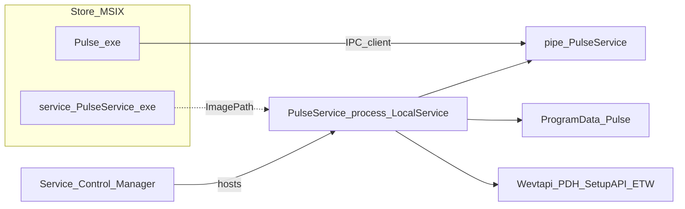
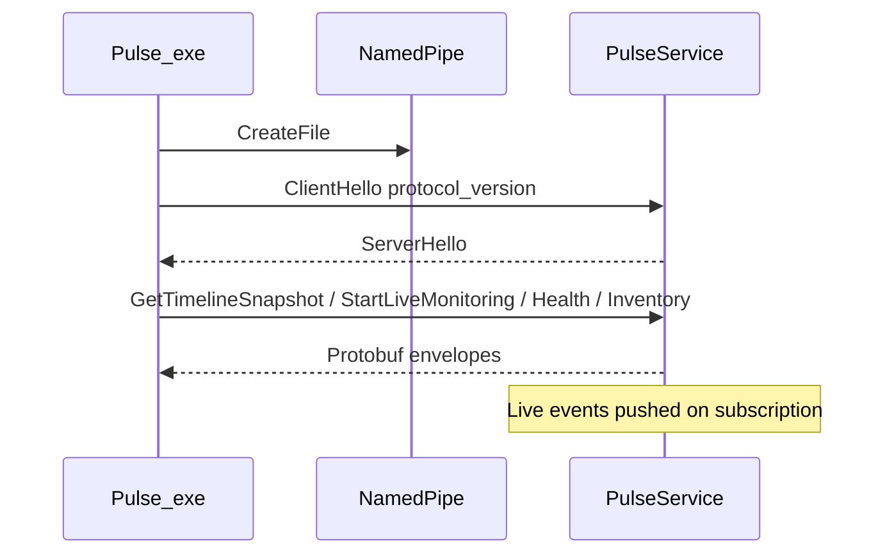
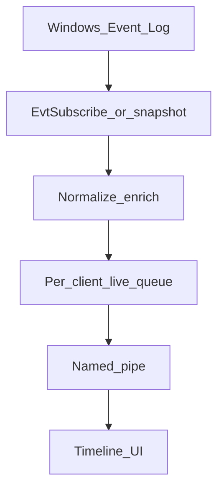
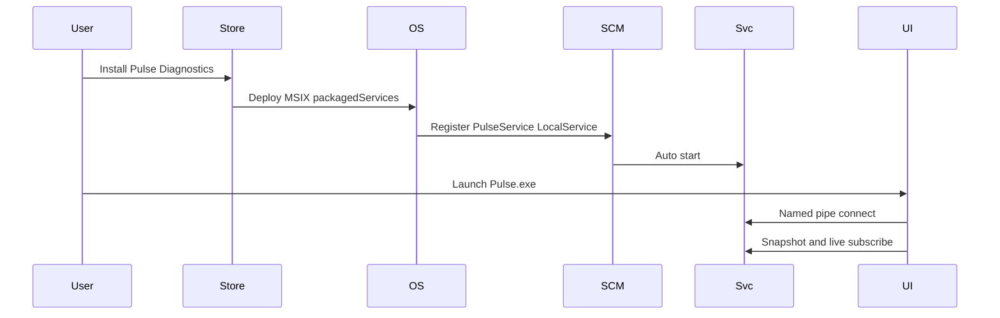
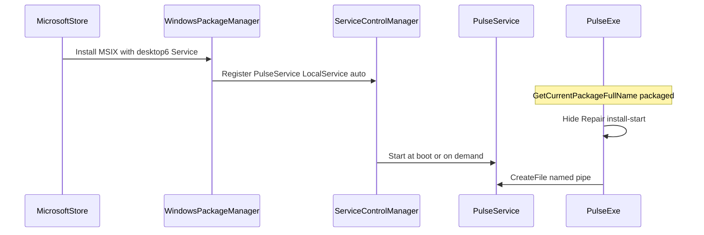
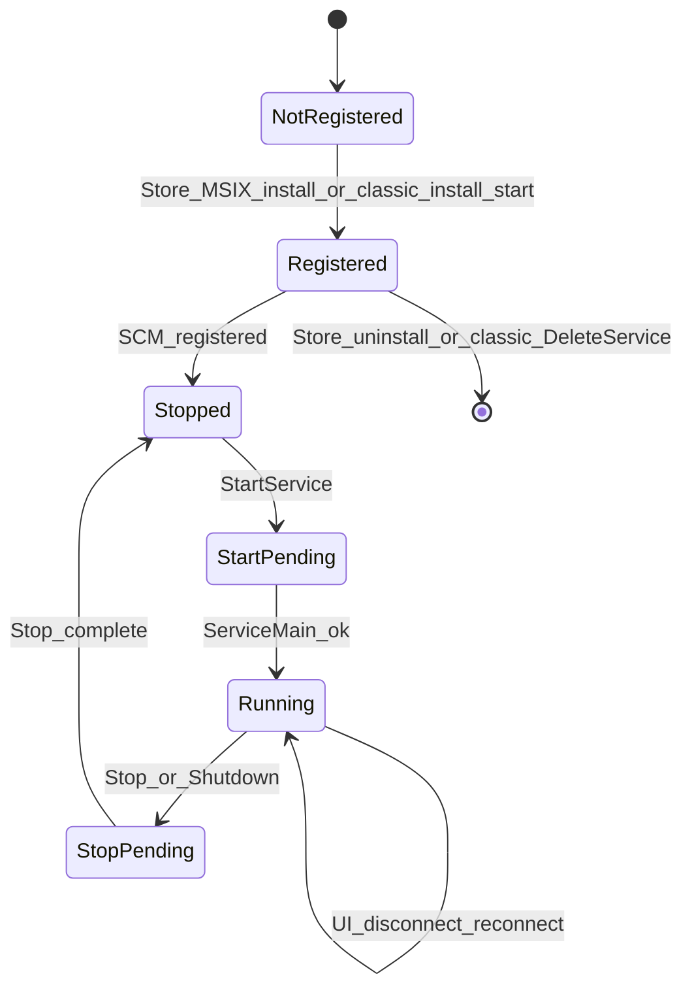
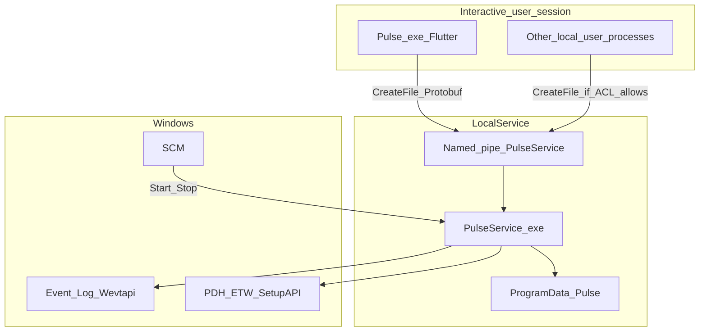

# Pulse Diagnostics — Business Justification for `packagedServices`

**Audience:** Microsoft Store / Partner Center certification (restricted capability review)  
**Product:** Pulse Diagnostics (`Regncreative.PulseDiagnostics`, Store ID `9PNDTLNTJ82T`)  
**Capability requested:** `packagedServices` only  
**Capability not requested:** `localSystemServices`  
**Service account:** Local Service (`desktop6:Service` `StartAccount="localService"`)  
**Package service binary:** `service\PulseService.exe`  
**Document type:** Restricted capability business justification (code-backed)  
**Distribution channels:** Microsoft Store (MSIX) and GitHub/Inno (classic)  
**Document version:** 1.3

---

## How to read this document

This document is written for Microsoft’s restricted capability review. The opening sections answer why `packagedServices` is required for the Store product. Appendices provide implementation evidence. Claims are limited to behavior present in the current codebase; unimplemented ideas are not asserted as product capabilities.

Product rules: [AGENTS.md](../../AGENTS.md) — observation only; never inject, patch, hook, or bypass Windows security; local-first; no telemetry.

---

# Executive Business Justification

**Pulse Diagnostics** is a professional, **read-only Windows observability** application for **IT professionals, developers, and system administrators**. It presents Event Log activity, system health, hardware/software inventory, and diagnostics status in a modern desktop UI, as defined by product architecture ([AGENTS.md](../../AGENTS.md), [ADR-002](../architecture/decisions/ADR-002-windows-service.md)).

## Business problem this capability solves

Pulse is designed as a **two-process product**: a Flutter UI (`Pulse.exe`) and a Windows Service observation host (`PulseService.exe`). Architecture requires diagnostic collection to run in the service, not in the UI ([01-system-overview.md](../architecture/01-system-overview.md)). That host must remain available under Service Control Manager (SCM) after the UI exits and after interactive logoff—the same model already shipping on GitHub/Inno.

On the **GitHub / Inno** channel, `PulseService.exe` registers as **`NT AUTHORITY\LocalService`** via `CreateServiceW` ([`service_core.cpp`](../../service/pulse_service/src/service_core/service_core.cpp)). On the **Microsoft Store** channel, the same Local Service must be registered from the MSIX via `desktop6:Service`. Windows requires the restricted capability **`packagedServices`** for that registration. Without it, the Store edition cannot register the service host and cannot match the GitHub product’s observation architecture.

Store packaging validates that `service\PulseService.exe` is embedded and that `packagedServices` is declared ([`validate_msix_store.ps1`](../../tools/scripts/validate_msix_store.ps1), [`microsoft-store.md`](../guides/microsoft-store.md)). A UI-only Store package is treated as an incomplete/unusable core feature in that packaging guidance.

## What we are requesting

| Item | Request |
|------|---------|
| Capability | **`packagedServices` only** |
| Not requested | **`localSystemServices`** |
| Service | `PulseService` |
| Account | **Local Service** (`StartAccount="localService"`) |
| Startup | Automatic (`StartupType="auto"`) |
| Binary | `service\PulseService.exe` inside the Store package |

`runFullTrust`, StartupTask, Scheduled Tasks, user-mode background processes, and relocating collectors into the UI cannot provide this Local Service host model. Classic `CreateService` from the Store app is refused under package identity. Details below.

## Why Local Service — and explicitly not Local System

Pulse uses least privilege. **Local Service** is the account already used by the classic installer and is sufficient for the read-oriented Event Log, health, and inventory work implemented in `service/pulse_service`. **We intentionally do not request `localSystemServices`.** See the [LocalService capability matrix](#localservice-capability-matrix).

## Approval request

Approve **`packagedServices`** so the Microsoft Store edition can register the existing Local Service observation host via `desktop6:Service` and achieve **feature parity** with the GitHub/Inno edition—without elevating to Local System.

---

# Observation model (precise, code-backed)

Microsoft reviewers should distinguish three layers. The document does **not** claim that every collector is actively subscribed for every second the UI is closed.

| Layer | What runs | When it starts (code) | Survives UI close? |
|-------|-----------|------------------------|--------------------|
| **Persistent service host** | `PulseService` under SCM; named-pipe accept loop | Service start → `IpcServer::Start()` ([`ipc_server.cpp`](../../service/pulse_service/src/ipc/ipc_server.cpp)) | **Yes** — UI exit does not stop the service |
| **Health infrastructure** | Health collector initialize + health push thread | `IpcServer::Start()` calls `EnsureHealthCollector()` and starts `HealthPushLoop` | **Yes** — initialized with the service; client push is gated per connected client |
| **Event Log live subscription** | `EvtSubscribe` on accessible diagnostics channels | **Lazy:** `StartLiveMonitoring` → `EnsureLiveSubscriber()` ([`ipc_server.cpp`](../../service/pulse_service/src/ipc/ipc_server.cpp)) | **Host yes; live subscribe only after enabled** — snapshot/detail remain available on demand when the UI reconnects |

**Accurate product claim:** With `packagedServices`, the Store edition keeps a durable Local Service **host and IPC endpoint** (and health infrastructure started with that host). Event Log **live** streaming starts when the product enables live monitoring; it is not asserted as always-on solely because the service process exists.

---

# Store vs GitHub feature parity

This request is primarily a **Store-compatible registration path** for an observation architecture that already ships on GitHub—not a request for new privileges beyond Local Service.

| Product capability | GitHub / Inno (shipping) | Store without `packagedServices` | Store with `packagedServices` |
|--------------------|--------------------------|----------------------------------|-------------------------------|
| Durable Local Service observation host | Yes — `PulseService` | No package-owned service registration | Yes — `desktop6:Service` |
| Named-pipe IPC server available after UI exit | Yes | No durable host | Yes |
| Health infrastructure starts with service | Yes (`IpcServer::Start`) | N/A / UI-only incomplete | Yes |
| Event Log live subscribe (when enabled) | Yes (lazy in service) | No service host | Yes (same lazy model) |
| Survives user logoff (service session) | Yes | No (UI/session-only designs) | Yes |
| Auto-start under SCM | Yes (`SERVICE_AUTO_START`) | No | Yes (`StartupType=auto`) |
| Service account | `NT AUTHORITY\LocalService` | N/A | `localService` |
| How registered | Elevated `--install-start` / `CreateServiceW` | Blocked under package identity | MSIX `desktop6:Service` |
| UI as presentation client only | Yes | Incomplete vs architecture | Yes |

**Evidence:** classic LocalService install in [`service_core.cpp`](../../service/pulse_service/src/service_core/service_core.cpp) and [`Pulse.iss`](../../tools/installer/Pulse.iss); Store declaration in [`package_msix_store.ps1`](../../tools/scripts/package_msix_store.ps1); packaged builds refuse classic install ([`IsRunningAsPackagedApp`](../../service/pulse_service/src/service_core/service_core.cpp); Store UI hides Repair/`--install-start` in [`service_lifecycle_controller.dart`](../../apps/pulse_app/lib/application/service_lifecycle_controller.dart)).

Without `packagedServices`, Store customers cannot receive the same Local Service observation host that GitHub customers already have.

---

# Why StartupTask, runFullTrust, scheduled tasks, and background processes are insufficient

For Pulse, each alternative fails a **product requirement encoded in architecture and code**, not a preference.

## `runFullTrust` alone (UI process only)

The Store package already uses `runFullTrust` for `Pulse.exe` ([`pubspec.yaml` `msix_config`](../../apps/pulse_app/pubspec.yaml)). That is necessary for the desktop UI. It is **not** sufficient:

- Closing `Pulse.exe` ends the UI process; collectors hosted there would stop with it.
- Architecture forbids calling Event Log / health / inventory collection APIs from the UI ([01-system-overview.md](../architecture/01-system-overview.md)).
- The named-pipe **server** lives in `PulseService` ([`ipc_server.cpp`](../../service/pulse_service/src/ipc/ipc_server.cpp)); the UI is a `CreateFile` client ([`pulse_ipc_client.dart`](../../apps/pulse_app/lib/ipc/pulse_ipc_client.dart)).

**Impact:** a Store build limited to `runFullTrust` cannot implement the shipping two-process observation model and fails Store packaging validation that requires an embedded `PulseService.exe` ([`validate_msix_store.ps1`](../../tools/scripts/validate_msix_store.ps1)).

## `StartupTask`

- Runs in the **interactive user session**, not as Local Service.
- Ends at logoff; does not provide the machine Local Service session used by the GitHub build.
- Does not create an SCM service with `StartupType=auto` / `SERVICE_AUTO_START`.
- Does not replace `StartServiceCtrlDispatcherW` / `ServiceMain` ([`service_core.cpp`](../../service/pulse_service/src/service_core/service_core.cpp)).

**Impact:** would produce a session-bound helper, not the Local Service host already shipping on GitHub.

## Scheduled Task

- Pulse’s IPC accept loop, health push thread, and (when enabled) Event Log live subscribe are **long-running service paths**, not periodic batch jobs ([`ipc_server.cpp`](../../service/pulse_service/src/ipc/ipc_server.cpp)).
- Task Scheduler does not provide the SCM service contract Pulse implements (STOP/SHUTDOWN handling, auto-start service registration).
- Rebuilding as a scheduled executable would abandon the architecture validated on GitHub ([ADR-002](../architecture/decisions/ADR-002-windows-service.md)).

**Impact:** cannot host the implemented service + named-pipe server model.

## User-mode background / tray process

- Remains a user-session process; ends at logoff.
- Does not use the Local Service identity that creates the pipe under the service SDDL (`LS` ACE in [`constants.hpp`](../../shared/pulse_common/include/pulse/constants.hpp)).
- Does not provide SCM install/uninstall/start/stop lifecycle as implemented for `PulseService`.

**Impact:** not equivalent to the GitHub Local Service product.

## Classic `CreateService` from the Store package

Under package identity, `--install` / `--uninstall` are refused; Store UI hides Repair/`--install-start` ([`service_core.cpp`](../../service/pulse_service/src/service_core/service_core.cpp), [`service_lifecycle_controller.dart`](../../apps/pulse_app/lib/application/service_lifecycle_controller.dart)). Package-owned `desktop6:Service` registration is the Store-compatible mechanism—and requires `packagedServices`.

---

# Why moving collectors into the UI is not a valid Store replacement

A common review question is whether Pulse could avoid `packagedServices` by calling Wevtapi/PDH/SetupAPI directly from `Pulse.exe`.

| Objection | Code-backed response |
|-----------|----------------------|
| “Put collectors in the UI” | Violates normative architecture: Flutter must not call Windows diagnostic collection APIs for Event Log / health / inventory ([01-system-overview.md](../architecture/01-system-overview.md), [ADR-002](../architecture/decisions/ADR-002-windows-service.md)). |
| “UI can stay running in background” | Closing the Store app still ends the UI process; the product requires an SCM Local Service host independent of that process. |
| “Snapshots on UI open are enough” | The product also implements a durable pipe server, health infrastructure started with the service, and live Event Log subscribe when enabled—all inside `PulseService` ([`ipc_server.cpp`](../../service/pulse_service/src/ipc/ipc_server.cpp)). Relocating that surface into the UI would redesign the shipping GitHub architecture and break Store↔GitHub parity. |
| “Then use StartupTask for the UI” | Still user-session, not Local Service; fails logoff/SCM requirements above. |

**Conclusion:** UI-hosted collectors are not a Store-compatible substitute for the existing Local Service observation host. `packagedServices` is the registration capability that host requires on Store.

---

# Exact responsibilities of PulseService

PulseService is the product’s **observation host**. Responsibilities below are required for the Store app to deliver advertised diagnostics through the existing IPC protocol.

| Responsibility | What the UI presents | Why a Windows Service host is required |
|----------------|----------------------|----------------------------------------|
| **Named-pipe IPC server** | Connected diagnostics session | Pipe server must outlive UI process exit/relaunch ([`ipc_server.cpp`](../../service/pulse_service/src/ipc/ipc_server.cpp)) |
| **Event Log snapshot / detail** | Timeline views on demand | Implemented in the service; UI is IPC client only |
| **Event Log live subscribe (when enabled)** | Live timeline updates after `StartLiveMonitoring` | Subscribe runs in the service host, not in Flutter |
| **System health monitoring** | CPU, memory, disk, adapter, process health | Health collector initializes at service IPC start (`EnsureHealthCollector`) |
| **Hardware / software inventory** | Device, driver, service, software catalogs | Inventory collectors run under the service ([`inventory/`](../../service/pulse_service/src/inventory/)) |
| **Diagnostics identity / status** | Service running/version/path status | Meaningful only if an SCM service exists |
| **Local logs & config under ProgramData** | Stable local config/logs across updates | Service owns `%ProgramData%\Pulse\` ([`config.cpp`](../../service/pulse_service/src/util/config.cpp)) |

### What PulseService is not responsible for

| Non-responsibility | Why it matters to this review |
|--------------------|-------------------------------|
| UI rendering, settings, export dialogs | Remain in `Pulse.exe` |
| Remote management / cloud agent | Not implemented |
| Plugin hosting or script execution | Not implemented ([ADR-006](../architecture/decisions/ADR-006-plugin-deferral.md)) |
| Antivirus, cleaner, optimizer, or booster | Out of product scope ([AGENTS.md](../../AGENTS.md)) |
| Classic SCM self-install when packaged | Refused under package identity |

---

# Why LocalService is required — and why LocalSystem is not requested

## Why LocalService is required

| Requirement | Why LocalService |
|-------------|------------------|
| Durable host after logoff | Machine service identity, not an interactive user process |
| Least privilege for implemented collectors | Sufficient for System/Application and other accessible channels; Security is probe-open and skipped when denied ([`event_log_channels.cpp`](../../service/pulse_service/src/collectors/event_log_channels.cpp)) |
| Feature parity with GitHub | Classic installer already uses `NT AUTHORITY\LocalService` |
| Store packaging model | `desktop6:Service` `StartAccount="localService"` → `packagedServices` |
| Named-pipe ownership | Service process creates the pipe with `LS` full access in SDDL |

## LocalService capability matrix

Based on the current `service/pulse_service` implementation (not a request for additional rights):

| Capability / operation | Under LocalService in Pulse | Notes |
|------------------------|----------------------------|-------|
| Open/query/subscribe **System** Event Log | **Yes** (required channel) | [`event_log_channels.cpp`](../../service/pulse_service/src/collectors/event_log_channels.cpp) |
| Open **Application** / **Setup** / selected Operational logs | **Yes** when accessible (optional) | Skipped/warned if open fails at use time |
| Open **Security** Event Log | **Often no** | `ProbeOpen`; ACL failure accepted—**not** used to justify LocalSystem |
| PDH / health counters, process limited query | **Yes** | Health collectors |
| SetupAPI / inventory reads; HKLM Uninstall **read** | **Yes** (read-oriented) | No `RegSet*` / `RegCreate*` / `RegDelete*` found in service `src` |
| Create local named pipe `\\.\pipe\PulseService` | **Yes** | Service owns pipe; SDDL includes `LS` |
| Listen on remote TCP/HTTP | **No** | Not implemented |
| Execute PowerShell / cmd / arbitrary processes | **No** | No spawn APIs found in service |
| Process injection / security-policy changes | **No** | Not implemented; forbidden by AGENTS.md |
| Download plugins / load plugin DLLs | **No** | Not implemented |
| Credential APIs | **No** | Not found |

## Why LocalSystem is intentionally NOT requested

| Concern | Pulse position |
|---------|----------------|
| Privilege | Above what the implemented read-oriented collectors require |
| Restricted capability | Would require **`localSystemServices`** — **not requested** |
| Product policy | [AGENTS.md](../../AGENTS.md) requires least privilege |
| Security Event Log | Denied access is accepted under LocalService rather than elevating |
| Trust boundary | LocalSystem would expand machine trust beyond product need |

**Clear statement for Partner Center:** Pulse Diagnostics requests **`packagedServices` only**, with **`StartAccount="localService"`**. We do **not** request Local System or `localSystemServices`.

---

# Customer value

## Who the product is for

Intended audience from product positioning ([AGENTS.md](../../AGENTS.md), Store listing as Pulse Diagnostics):

- **IT professionals** — Event Log and system health in one tool  
- **Developers** — process, service, and Event Log behavior on development PCs  
- **System administrators** — inventory and diagnostics with a local-first, read-only design  

## What the Store SKU loses without this capability

| Product requirement (from architecture/code) | If `packagedServices` is denied |
|-----------------------------------------------|----------------------------------|
| Durable Local Service host after UI exit | No package-owned service; UI-only process ends with the app |
| Health infrastructure started with the service | No service `IpcServer::Start` host |
| Event Log live subscribe in the service (when enabled) | No service-side subscribe path |
| Same Local Service model as GitHub | Store edition cannot register that host |
| Least-privilege background host on Store | No supported Store registration path for Local Service |

Closing `Pulse.exe` does **not** stop `PulseService` when the service is registered. The UI reconnects on next launch ([`pulse_ipc_client.dart`](../../apps/pulse_app/lib/ipc/pulse_ipc_client.dart)).

---

# IPC security

Communication between UI and service is a **local named pipe only**—not a remote network service.

## Transport

| Property | Implementation |
|----------|----------------|
| Name | `\\.\pipe\PulseService` ([`constants.hpp`](../../shared/pulse_common/include/pulse/constants.hpp)) |
| Scope | Same machine (`\\.\pipe\...`); no TCP/HTTP listener found in service sources |
| Framing | Length-prefixed Protobuf (`PULS` magic + payload) ([`pulse.proto`](../../shared/pulse_protocol/proto/pulse.proto)) |
| Protocol check | `ClientHello.protocol_version` must match; mismatch returns an error |

## SDDL (explicit)

Pipe security descriptor applied at `CreateNamedPipeW` ([`ipc_server.cpp`](../../service/pulse_service/src/ipc/ipc_server.cpp)):

```text
D:(A;;GA;;;SY)(A;;GA;;;LS)(A;;GRGW;;;BA)(A;;GRGW;;;BU)
```

| ACE | Meaning |
|-----|---------|
| **SY** (Local System) | Generic all |
| **LS** (Local Service) | Generic all — service account that owns the pipe |
| **BA** (Built-in Administrators) | Generic read/write |
| **BU** (Built-in Users) | Generic read/write |

### Honest disclosure: Built-in Users access

Any local process running as a normal user that passes this ACL **can open the pipe** and send protobuf requests the server understands (timeline, health, inventory, diagnostics). There is **no** client process-ID allowlist, named-pipe impersonation gate, or mutual TLS in the current code.

**Impact bound:** that surface is **local diagnostics RPC only**. The service does **not** expose arbitrary command execution, script host, plugin load, or remote administration APIs. This is a same-machine diagnostics bus, not a remote management endpoint.

## What IPC is and is not

| Is | Is not |
|----|--------|
| Local named pipe on the same PC | Remote TCP/HTTP/WebSocket endpoint |
| Diagnostics schema RPCs (snapshot, live monitor, health, inventory, diagnostics status) | Shell/PowerShell/cmd execution channel |
| Protocol version check on hello | Cryptographic client attestation (not implemented) |
| SDDL-restricted local principals | Internet-facing listener |

---

# Security commitments

Statements below apply to **`PulseService.exe`** under `service/pulse_service`, and to Store packaging gates.

| Commitment | Meaning for this review |
|------------|-------------------------|
| No arbitrary command execution | Diagnostics RPCs only; no shell-command API |
| No PowerShell / `cmd.exe` launch | No process-spawn APIs found in the service |
| No process injection | No OS injection APIs; AGENTS.md forbids injection |
| No download of executables or plugins | No download client; no plugin host |
| No Windows security-policy changes | No security-setting or registry-write APIs found in service sources |
| No remote telemetry / C2 channel | No HTTP(S)/WinHTTP client or upload worker in the service |
| No credential harvesting | No credential APIs found |
| Persistence only via SCM registration | Store `desktop6:Service` or classic `CreateService` — no Run-key persistence code in the service |

### Scope clarifications

- **Start/Stop/Restart from the UI** may prompt UAC (`runas`) to launch **`PulseService.exe`** with `--start` / `--stop` / `--restart` after explicit user action ([`pulse_service_launcher.dart`](../../apps/pulse_app/lib/platform/pulse_service_launcher.dart)).
- **Store updates** are delivered by the Microsoft Store; PulseService does not download binaries.
- See [UI `internetClient` capability](#ui-internetclient-capability) for the UI package network declaration.

---

# UI `internetClient` capability

**Finding (code review):** the Store Flutter package currently declares `internetClient` alongside `runFullTrust` and `packagedServices` ([`apps/pulse_app/pubspec.yaml`](../../apps/pulse_app/pubspec.yaml) `msix_config.capabilities`).

| Check | Result |
|-------|--------|
| HTTP client dependency in app `pubspec.yaml` | **None** (no `http`, `dio`, `url_launcher`, etc.) |
| First-party telemetry/analytics SDK | **None** found |
| Outbound network client in `apps/pulse_app/lib` | **None** found |
| GitHub releases URL in Settings | Displayed as **text** only (`SettingsController.releasesUrl`); not launched via a URL launcher API in code reviewed |
| PulseService remote client | **None** — service has no HTTP/WinHTTP client |

**Recommendation for Store submission:** **remove `internetClient` from the Store MSIX capability list** unless/until a concrete UI feature requires it and is documented. It is **not** required for `packagedServices` or for PulseService. Leaving an unused network capability next to a packaged service weakens the least-privilege story for reviewers.

This justification does **not** claim `internetClient` is needed for the service.

---

# Capability request summary

| Item | Value |
|------|-------|
| Capability | `packagedServices` |
| Not requested | `localSystemServices` |
| Service name | `PulseService` |
| Start account | `localService` |
| Startup | `auto` |
| Binary | `service\PulseService.exe` inside the MSIX |
| Business purpose | Register the existing Local Service observation host on Store for GitHub feature parity |
| Related packaging note | Remove unused UI `internetClient` unless a documented UI feature needs it |

---

# Executive Certification Checklist

| Microsoft Question | Short Answer | Reference |
|--------------------|-------------|----------|
| Why is StartupTask or runFullTrust insufficient? | They cannot provide an SCM Local Service host that outlives the UI and matches GitHub. | [Why alternatives are insufficient](#why-startuptask-runfulltrust-scheduled-tasks-and-background-processes-are-insufficient) |
| Why not put collectors in the UI? | Architecture forbids it; would break the shipping two-process model. | [Why moving collectors into the UI is not a valid Store replacement](#why-moving-collectors-into-the-ui-is-not-a-valid-store-replacement) |
| Why is LocalService required? | Least-privilege durable service identity; matches GitHub; sufficient for implemented collectors. | [LocalService capability matrix](#localservice-capability-matrix) |
| Why not LocalSystem? | Not needed; Security log denial accepted; `localSystemServices` not requested. | [Why LocalSystem is intentionally NOT requested](#why-localsystem-is-intentionally-not-requested) |
| What are PulseService responsibilities? | IPC host, Event Log snapshot/live-when-enabled, health, inventory, ProgramData logs/config. | [Exact responsibilities of PulseService](#exact-responsibilities-of-pulseservice) |
| Does Event Log collect continuously with UI closed? | Host persists; live subscribe is lazy after `StartLiveMonitoring`; snapshots on demand. | [Observation model](#observation-model-precise-code-backed) |
| How is IPC secured? | Local named pipe; explicit SDDL (incl. BU); diagnostics RPCs only; no remote endpoint. | [IPC security](#ipc-security) |
| Does the service execute arbitrary commands? | No. | [Security commitments](#security-commitments) |
| Does the service download or load plugins? | No. | [Security commitments](#security-commitments) |
| Does the service expose remote management? | No — local named pipe only. | [IPC security](#ipc-security) |
| Does the service collect telemetry? | No first-party telemetry. | [Privacy](#privacy) |
| Why is `internetClient` declared? | Currently unused in UI code review; **recommend removal** from Store package. | [UI internetClient capability](#ui-internetclient-capability) |
| Why is `packagedServices` required? | Only Store-compatible way to register the Local Service host already used on GitHub. | [Store vs GitHub feature parity](#store-vs-github-feature-parity) |
| Is `localSystemServices` requested? | No. | [Capability request summary](#capability-request-summary) |
| What happens when the UI closes? | Service host continues; UI reconnects later. | [Observation model](#observation-model-precise-code-backed) |

---

# Product architecture (summary)

| Process | Role | Technology |
|---------|------|------------|
| `Pulse.exe` | Presentation client | Flutter Desktop |
| `PulseService.exe` | Observation host (SCM Local Service) | C++ Windows Service |

Store packaging embeds the service binary and declares:

```xml
<desktop6:Extension Category="windows.service"
    Executable="service\PulseService.exe"
    EntryPoint="Windows.FullTrustApplication">
  <desktop6:Service Name="PulseService"
      StartupType="auto"
      StartAccount="localService" />
</desktop6:Extension>
```

([`package_msix_store.ps1`](../../tools/scripts/package_msix_store.ps1), [`validate_msix_store.ps1`](../../tools/scripts/validate_msix_store.ps1)).

---

# Security model

## Where data lives

| Path | Purpose |
|------|---------|
| `%ProgramData%\Pulse\config.json` | Local service configuration |
| `%ProgramData%\Pulse\logs\...` | Local structured service logs |
| `%ProgramData%\Pulse\data\` | Local data layout |

Resolved via `SHGetKnownFolderPath(FOLDERID_ProgramData)` ([`config.cpp`](../../service/pulse_service/src/util/config.cpp)). The service does not write into the MSIX install directory.

## Least privilege in practice

- Account = LocalService (not LocalSystem) — see [capability matrix](#localservice-capability-matrix).
- Observation APIs are read-oriented.
- Day-to-day observation does not require admin after install.
- Packaged builds refuse classic SCM self-install.
- Start/Stop/Restart from the UI use explicit UAC when the user chooses those actions.

---

# Privacy

| Topic | Statement |
|-------|-----------|
| Collected categories | Event Log (accessible channels), health metrics, inventory, Pulse diagnostics status — local only |
| Sensitivity | May include hostnames, executable paths, Event Log message text, and process metadata exposed to LocalService |
| Network rates | Health may use local ETW/PDH-style **rate** metrics; not HTTPS payload inspection / MITM |
| Storage | `%ProgramData%\Pulse\` (service); local UI preferences |
| Telemetry | No first-party telemetry / analytics / tracking |
| Service network | No remote upload client in service sources |
| Store updates | Via Microsoft Store for the Store edition |

Optional GitHub-only PulseMCP is **not** included in the Store MSIX.

---

# Architecture diagrams

## Process architecture



## IPC



## Data flow (Event Log path)



## Service lifecycle (Store)



---

# Closing request to Microsoft

Pulse Diagnostics is already a **two-process product** on GitHub/Inno: a Flutter UI plus **`PulseService`** running as **Local Service**.

For the Microsoft Store edition, Windows cannot register that Local Service from the AppxManifest unless the package is granted **`packagedServices`**. Classic `CreateService` / `--install-start` is refused under package identity, so there is **no alternative Store-legal path** to the observation host architecture already shipping on GitHub.

### What approval enables

- Feature parity between **Store** and **GitHub** for the Local Service observation host and IPC endpoint  
- Health infrastructure and pipe server that outlive UI process exit  
- Event Log live subscription **when enabled**, hosted in the service—not in the UI  
- Least-privilege Local Service operation — **not** Local System  

### What we are not asking for

- `localSystemServices`  
- Broader privileges than Local Service  
- Remote management, plugins, scripting, or telemetry capabilities  
- Retention of unused UI `internetClient` (recommend removal)

**We respectfully request approval of `packagedServices` for Pulse Diagnostics (`Regncreative.PulseDiagnostics`, Store ID `9PNDTLNTJ82T`) so the Store package can declare `desktop6:Service` with `StartAccount="localService"` and ship the same core observation-host experience as the classic installer.**

This justification reflects the repository as implemented for the Store packaged-service edition.

---

# Appendix A — Alternative analysis (implementation evidence)

## 1. `runFullTrust` UI only

Store package declares `runFullTrust` for `Pulse.exe` ([`pubspec.yaml` `msix_config`](../../apps/pulse_app/pubspec.yaml)). UI is an IPC client ([`pulse_ipc_client.dart`](../../apps/pulse_app/lib/ipc/pulse_ipc_client.dart)); pipe server is in [`ipc_server.cpp`](../../service/pulse_service/src/ipc/ipc_server.cpp). Architecture keeps collectors out of the UI ([01-system-overview.md](../architecture/01-system-overview.md)).

## 2. `StartupTask`

User-session launch only; no LocalService SCM model (`StartServiceCtrlDispatcherW` / `ServiceMain` in [`service_core.cpp`](../../service/pulse_service/src/service_core/service_core.cpp)).

## 3. Scheduled Task

IPC accept loop, health push thread, and lazy Event Log live subscribe are long-running service paths in `IpcServer`, not periodic batch work.

## 4. User-mode background process

No SCM STOP/SHUTDOWN contract; no LocalService identity used by the shipping service.

## 5. Classic `CreateService` from Store

`--install` / `--uninstall` refused when packaged; Store UI hides Repair/`--install-start` ([`service_core.cpp`](../../service/pulse_service/src/service_core/service_core.cpp), [`service_lifecycle_controller.dart`](../../apps/pulse_app/lib/application/service_lifecycle_controller.dart)).

---

# Appendix B — PulseService responsibilities (source map)

| Responsibility | Primary code |
|----------------|--------------|
| Named-pipe IPC server | [`ipc_server.cpp`](../../service/pulse_service/src/ipc/ipc_server.cpp) |
| Event Log timeline | [`event_log_channels.cpp`](../../service/pulse_service/src/collectors/event_log_channels.cpp), live/snapshot paths in `ipc_server.cpp` |
| System health | [`health_metrics_collector.cpp`](../../service/pulse_service/src/collectors/health_metrics_collector.cpp), [`network_etw_engine.cpp`](../../service/pulse_service/src/collectors/network_etw_engine.cpp) |
| Inventory | [`service/pulse_service/src/inventory/`](../../service/pulse_service/src/inventory/) |
| Diagnostics identity / status | [`diagnostics/`](../../service/pulse_service/src/diagnostics/) |
| Local logging | [`logger.cpp`](../../service/pulse_service/src/logging/logger.cpp) |
| Local configuration | [`config.cpp`](../../service/pulse_service/src/util/config.cpp) |

**Conditional behaviors:** Security channel is probe-opened and skipped if ACL-denied under LocalService; network ETW is used for local per-process rate metrics only; IPC `InjectDiagnosticsTestEvent` synthesizes a timeline test event (not OS injection).

**Not in Store MSIX:** PulseMCP (`PulseMCP.exe`) — GitHub-only today.

---

# Appendix C — Service lifecycle

## GitHub / Inno (classic)

1. Installer deploys `PulseService.exe`.
2. Elevated `--install-start` → `CreateServiceW` with `NT AUTHORITY\LocalService`, auto-start.
3. Service started to `SERVICE_RUNNING`.

## Microsoft Store

1. Customer installs MSIX.
2. Windows registers `desktop6:Service` (`PulseService`, auto, localService).
3. App/service do not call `CreateService` when packaged.



## Runtime notes

- SCM launches service → `ServiceMain` → IPC accept loop; `IpcServer::Start` initializes health infrastructure.
- Event Log live subscribe starts on `StartLiveMonitoring` (lazy).
- UI close does not stop the service; UI reconnects later.
- Custom SCM failure-action timers are **not** configured in the current Store manifest; we do not claim custom crash-restart scheduling beyond Windows defaults.



---

# Appendix D — IPC (additional evidence)

See main section [IPC security](#ipc-security) for SDDL, BU disclosure, and diagnostics-only bounds.

Additional notes:

- Max pipe instances default 32 (config clamp 2–64)
- Clients: Store UI (`Pulse.exe`); optional GitHub-only PulseMCP; engineering tools
- Not implemented: mutual TLS, PID allowlists, pipe impersonation tokens

---

# Appendix E — Limits and threat model

| Limit | Status |
|-------|--------|
| Cannot execute arbitrary commands / scripts | True |
| Cannot launch PowerShell / cmd.exe | True |
| Cannot download or load plugins | True |
| Cannot modify Windows security settings | True |
| Cannot expose a remote API | True — local named pipe only |
| Cannot perform OS code injection | True |
| Cannot capture credentials | True |



| Risk | Mitigation |
|------|------------|
| Store app recreating classic services | Package identity refuses `--install` / `--uninstall` |
| LocalSystem privilege creep | Not used; `localSystemServices` not requested |
| Remote exploitation | No remote listener found |
| Local pipe access by BU | Disclosed; diagnostics RPCs only; no command execution |
| Plugin malware | No plugin loader |
| Silent elevation | Start/Stop uses interactive UAC |

---

# Appendix F — Source index

| Topic | Artifacts |
|-------|-----------|
| Product constitution | [`AGENTS.md`](../../AGENTS.md) |
| Service decision | [`ADR-002`](../architecture/decisions/ADR-002-windows-service.md) |
| IPC decision | [`ADR-003`](../architecture/decisions/ADR-003-named-pipe-ipc.md) |
| SCM + package gate | [`service_core.cpp`](../../service/pulse_service/src/service_core/service_core.cpp) |
| IPC server | [`ipc_server.cpp`](../../service/pulse_service/src/ipc/ipc_server.cpp) |
| Event Log channels | [`event_log_channels.cpp`](../../service/pulse_service/src/collectors/event_log_channels.cpp) |
| Pipe SDDL | [`constants.hpp`](../../shared/pulse_common/include/pulse/constants.hpp) |
| Store packaging | [`package_msix_store.ps1`](../../tools/scripts/package_msix_store.ps1), [`validate_msix_store.ps1`](../../tools/scripts/validate_msix_store.ps1) |
| Store UI gates | [`service_lifecycle_controller.dart`](../../apps/pulse_app/lib/application/service_lifecycle_controller.dart), [`pulse_deployment.dart`](../../apps/pulse_app/lib/platform/pulse_deployment.dart) |
| Classic installer | [`Pulse.iss`](../../tools/installer/Pulse.iss) |
| Store vs classic notes | [`41-store-packaged-service.md`](../architecture/41-store-packaged-service.md), [`microsoft-store.md`](../guides/microsoft-store.md) |
| Plugin deferral | [`ADR-006`](../architecture/decisions/ADR-006-plugin-deferral.md) |
| UI capabilities | [`apps/pulse_app/pubspec.yaml`](../../apps/pulse_app/pubspec.yaml) |
